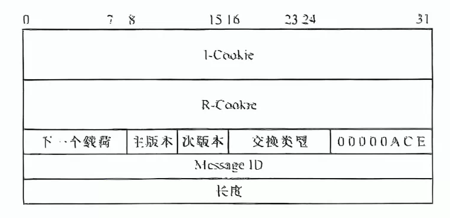
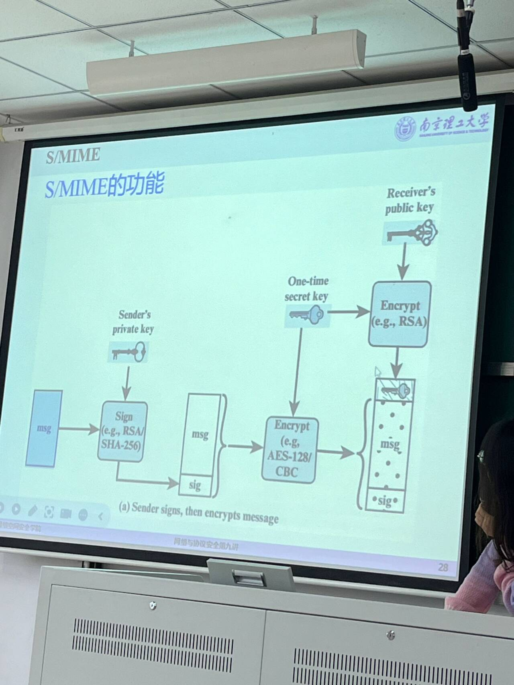

# 第一章 引入
## OSI七层模型
采用英文教材的TCP/IP模型，分为5层模型，合并物理链路层未链路层；将会话表示应用层合并为应用层。
## 攻击分类
### 被动/主动攻击
#### 被动
- 窃听；
- 搭线监听、无线截取；
看不出异常，比较隐蔽；可以使用VPN、加密技术等防范
#### 主动
主动干扰通信过程,中间人修改信息
- 假冒、重放、篡改信息、拒绝服务
- 容易检测出来，但不易防范。可以使用自动审计、入侵检测和完整性恢复等。
### 网络安全需求
对于不同协议，不同场景，安全需求不同
1. **机密性**：防止**数据未授权公开**；无关用户不能读取
2. **完整性**：防止**数据篡改**
3. **可控性**：根据数据的敏感性和应用场景，要**设置不同用户能访问的资源和信息不同**。防止未授权的用户访问限制的资源。
4. **不可否认性**：通信实体对自己收发的数据负责。
5. **可用性**：合法用户能够使用，防止**拒绝服务攻击**
### 网安协议
从**密码学角度**保证安全，也是一个通信协议
### 影响协议设计的要素
从应用层:(Web/Email...)/协议栈层次(链路层PPP....)/安全性的角度考虑
### 密码学术语与原语
#### 术语和加解密表示
#### 加密
保证数据机密性
##### 分类1：
###### 对称密码SKE
- 加解密密钥相同
- 用于加密/消息摘要MD/消息认证码
- 加密效率高，一般用对称加密进行通信而不用非对称公钥密码。Des/AES。
- 设计时的需求：$\pi = (kGen密钥生成,Enc加密算法,Dec解密算法)$
    - $KGen(|^\lambda用户输入) = k密钥$,
    - $c = Enc(k,m)$
    - $m'= Dec(k,c)$
    - 要求$m=m'$
- 在公开信道上进行协商密钥：IPSec/TLS等最核心模块，有密钥分发问题，**N个用户需要N(N-1)/2个密钥**，分发困难。可以使用D-H算法等。
###### 非对称
有公私钥
加密（公钥加密）/数字签名；
多**用于交换对称密钥**。
- $\pi = (kGen,Enc,Dec)$
    - $KGen(|^\lambda用户输入) = k_{pub}(pk),k_{pri}(sk)$,
    - 发送时加密$c = Enc(pk,m)$注意加解密时公私钥选择。
    - 接受时解密$m'= Dec(sk,c)$
    - 要求$m=m'$
##### 分类2：
###### 分组密码
将明文分为长度相同n组，每组进行对称加密。可以使用CBC等模式加密。Des/Aes
###### 流密码
对明文m生成一个等长的随机密钥k，$m \oplus k$。属于对称密码。
#### 认证
完整性+不可否认性
##### 消息摘要Message Digest
Hash散列算法，生成相同长度的摘要输出。**输入长度可变而输出长度相同**，效率高。
###### MD5(Message Digest 5)、SHA-1(Secure Hash Algorithm)
- 表征该数据特征。一般用Hash（散列函数）完成，**多个输入可能对应同一个输出**。如：校验和。
- 散列函数的要求：
    1. 单向性：快速计算出H(M)，但构造逆函数$H^-1(M)$不可行。  
    2. 抗冲突性：弱抗冲突性：给定M，计算上给不出M'，使H(M)=H(M')；强抗冲突性：找不出任何一对M,M'，使H(M)=H(M')
    3. 通常满足抗冲突性，**且抗冲突性的强度是长度一半**(128位散列值抗64位冲突，$2^{64}$次操作后才冲突)。
##### 消息认证码MAC

- $\pi = (KGen, MAC, Verify)$
- 对明文m作Hash摘要，**对称密钥**加密后放入明文消息；接收到后解密摘要，对比明文的Hash值。
- 若将(Msg|摘要D)再用对称密钥加密，就可以**同时保证机密性**。
##### 数字签名（公钥）Sig
- 确保完整性（认证）和不可否认性。
- 对消息M进行哈希得到消息摘要，将摘要用**发送方私钥**加密后放在M后。接收方接收到消息后用**发送方公钥**解密，并对比摘要内容。由于使用了发送方公私钥加解密，可以进行身份认证。
## 密钥管理
### 基于可信第三方
KDC(Key Distribution Centre)。$K_{ak}、K_{bk}$是Alice、Bob和KDC之间的共享密钥；R是密钥生成请求。

### 密钥协商算法(共享密钥生成素材)
- Diffle-Hellman（DF算法）：双方共享大素数p、发生器g。g是公开的，且总是存在W,使$g^W \mod p = Z$,Z是小于p的所有数。
- 
### 基于公钥密码体制传输对称密钥
公钥管理：共享密钥需要安全传输，一般使用公钥密码传输。
- 直接在开放信道上传输公钥有中间人攻击。使用证书分发公钥，证书授权中心（CA，Certificate Authority，可信第三方 ）负责证书包含：拥有方的公钥（需要传输）、CA私钥加密的签名。
## 协议栈
端到端：应用、传输层；点对点：网络、链路层。**越底层的安全协议能保护所有上层协议**，但一般考虑内容更多，效率更低。对于特殊的高层应用，可以只考虑对于高层的安全协议。

# 链路层拓展L2TP
链路层**主要涉及认证功能**。
## PPP
规定了帧格式+建立、配置、测试PPP链路(**链路层**)的LCP(Link Control Protocol)协议+建立、配置网络层协议的NCP(Network Control Protocol)协议。
### 功能
建立两个设备的直连通路，需要实现**数据传输、数据认证和压缩功能**。
PPP上可以传输不同网络协议的数据，NCP对这些网络协议进行配置。
### PPP协议流程

#### 包含四个阶段
##### 先建立物理连接
##### LCP链路参数配置
建立PPP链路。发送LCP配置请求报文。
##### PAP/CHAP认证用户口令
发送方提供账号+口令。验证成功回发ACK。
##### IPCP配置IP地址、NCP配置网络协议
##### LCP链路停止
##### 停止物理连接
#### 多个链路状态
None表示不需要认证。

### PPP帧格式
- 前后F表示Flag标识开头结尾。
- A表示Address，点对点协议地址固定位FF。
- C控制信息，表示帧类型和序号。
- 不同“协议”参数对应不同协议：LCP、IPCP等。
- 数据中包含了对应协议的报文。
- FCS(Frame ChuckSum)校验和。

## LCP协议：链路参数协商
### 功能
用于**建立连接与配置链路**
1. 发送Configure-Request
2. 回发ACK、NAK或Reject
### 报文代码
不同报文代码对于不同LCP协议功能

### 回复报文
ACK（均识别并接受）
NAK（均识别但部分不接受，包含不接受的项）
Reject（有未识别，包含未识别和不接受的项）
### 报文格式
#### 链路配置协议报文

类型：报文类型。
选项：在Configure-Request配置报文中，有多个选项，*可以定义最大接收单元（选项类型编号1）、使用的认证协议（3）、质量协议（4）、幻数（5，若某个PPP通信实体**发现最近发出的幻术和收到的幻数总是相同，出现了环路**）、协议压缩（7）、地址控制压缩（8）
#### 链路维护

1. Code-Reject：无法识别LCP配置报文类型字段，直接放弃链路
2. Protocol-Reject：无法识别协议字段
3. Echo-Request：测试链路质量和性能
4. Discard-Request：测试用
## IPCP协议
配置、激活、禁止一个对等PPP双方的IP模块。协商过程与LCP类似，包含Configure-Request、Configure-ACK/NAK/reject、Terminate、Code-Reject报文。
#### 选项协商+报文格式
##### 多个IP地址：选项1，不用
##### IP压缩协议：选项2，协商使用的压缩协议
##### IP地址：选项3，发送方在Request中指定一个IP地址，或者发送方不指定，接收方在回发NAK时指定。

## PAP+CHAP：身份认证Authenticate
### PAP：身份认证
PAP报文明文传输，不能防止窃听、重放、穷举攻击。**只能在链路建立阶段使用，数据通信时无法使用**。
#### 报文格式

#### 认证流程:
1. 发送Authenticate-Request
2. 服务器回发ACK/NAK
### CHAP：挑战响应
能在建立链路和数据传输时均起到认证效果。
#### 流程

认证双方都有一个秘密值$s$。
1. 认证方向认证方发送一个挑战C，包含了一个随机数$c$
2. 被认证方使用散列函数（一般是MD5），输入$s,c$，计算得到散列值$A_1$，通过Response回发。
3. 认证方接收到$A_1$后也用散列函数计算$A_2=Hash(s,c)$，对比$A_1,A_2$，相同则Success，否则Failure
#### 报文格式

类型1、2是challenge和response使用的，值包含散列值，名字包含身份描述信息
类型3、4是Success、Failure使用的。
### PPTP
是PPP的拓展协议，用于建立虚拟网络VPN。
#### 安全选项
###### PAP：没有安全保障
###### HashedPAP：使用两种特殊算法对密码进行Hash，得到两个密码的散列值，只有认证功能。
HashPAP攻击：在Hash时，将密码全部变为大写，HashedPAP使用固定的14字节密码，分成两个7字节，放入DES中并使用一个固定值作为密钥进行加密，当成一个Hash函数。当密码超过14位则丢弃，少于14位则**补0**。大大降低了字典大小。

###### MS-CHAP:利用密码的两个哈希值作为DES密钥加密Challenge，回复会收到两个Challenge的回复。
MS-CHAP攻击：在Hash时，使用两种Hash方法。16位的密码**哈希值**0padding5i位到21位，分为三部分。三部分作为密钥，和Challenge进行加密，最后结果是8bit*3=24bit。

###### MS-CHAP2：增加了双向认证

###### 然而，无论所用密码的长度或强度如何，PPTPv2始终可以被以复杂度仅为$2^56$的攻击攻破
### L2TP
#### 架构  

- 在PPP传统模式下，一个用户主机和提供网络服务的ISP的路由器之间通过调制解调器，建立了一条PPP链路。对等段就是**用户主机和ISP路由器**，通过TCP/IP协议传输PPP报文，IP报文被封装到PPP报文中传送。
- 而在L2TP中，LAC和LNS就像是调制解调器，通过协商建立隧道，转发PPP报文。当一个远程主机需要与家乡主机(某个本地主机)建立**虚拟PPP链路**，就需要让远程主机接入LAC（也可能不通过LAC，直接与LNS沟通），LAC将远程主机发送的PPP帧封装到L2TP协议中，发送给LNS，由LNS解包L2TP帧并将PPP帧发送给家乡主机。这样，对等端就是**远程主机和家乡主机**，建立了一条虚拟的点对点链路。
#### L2TP模式
##### 强制模式
远程客户通过PPP链路接入LAC，发送PPP报文并让LAC封装为L2TP报文，LAC与LNS建立L2TP隧道，LNS解包并发送到内部局域网PPP链路。
##### 自发模式
远程客户主机自行运行L2TP，直接与LNS建立隧道通信。
##### 组成
###### LAC（L2TP接入集中器Access Concentrator）
###### LNS（L2TP网络服务器Network Server）
###### 远程主机
###### 局域网
##### 消息类型
###### 数据消息，通过L2TP数据通道传输，不保证可靠传输
###### 控制消息，通过L2TP控制通道传输，保证可靠传输
##### 控制连接和会话

一条虚拟隧道对应一个控制连接，可以承载多个会话。
LAC和LNS通过协商建立一个控制连接后，隧道建立成功，承载会话。当远程主机呼叫时，建立一个会话。每个控制连接和会话都有唯一标识。
#### 建立L2TP连接过程

图中假设了LAC发起控制连接请求，实际上**LAC、LNS**都可以发起。
图中的SCCRQ(0,0)等标识中，SCCRQ标识报文类型，后面两个数字是发送、接收序号。
每次相互发送报文时，接收方收到后必须**回发ACK**，包含在回发的报文中。如果没有回发的报文，还需要发送一个ZLB ACK报文，实体长度为0。
##### 建立控制连接
LAC和LNS协商控制连接的参数，**并利用CHAP协商认证身份**。
SCC：Start Contorl Connect开始e控制连接
###### SCCRQ（类型编号1）
请求发送方发送(此处为LAC)，参数可能有
1. 成帧方式、信号类型、隧道ID等信息
2. 单一隧道需求：如果**两个对等方同时发送SCCRQ，则建立两条隧道**。若参数中包含这个，则此方获胜，另外一方放弃建立隧道请求。若同时包含，则SCCRQ取值小的取胜；取值相同都放弃。
3. **Challenge，验证对等方身份。**
###### SCCRP(类型编号2)
LNS回发SCC响应，**包含了对SCCRQ的Challenge的响应，以及对LAC的Challenge**。
###### SCCCN(SCC已建立，Complete Notify，3)：LAC回发对SCCRP的Challenge响应
##### 建立会话：
可能有呼入和呼出两种情况，不代表必须同时出现。IC:Incoming Call；OC：Outcoming Call
1. 呼入：来自远程主机的呼入请求
2. 呼出：来自LNS的会话建立请求
###### 呼入会话
1. LAC接收到远程用户的呼叫请求时，向LNS发送ICRQ请求。包含了会话建立的参数,如会话ID、被叫/主叫号码、物理链路ID等。
2. LNS收到后回发ICRP，仅包含了会话ID。
3. LAC再发送ICCN，通告一些参数:
   1. LAC收发数据最大/小速率、成帧方法、要求必须包含序号等。
   2. 另外，在L2TP的额外功能中，ICCN报文还可能包含**LAC代理为PPP远程客户和LNS之间进行认证身份的报文，包含LAC和客户之间的Challenge、Chanllenge回应（CHAP）或者Authenticate-Request的用户名密码（PAP）**
   3. **远程客户与LAC之间建立PPP连接时使用的LCP配置，包括第一个Configure-Request和最后一个Configure-Request中包含的参数**
###### 呼出会话
1. LNS向LAC发送OCRQ，包含会话ID、被叫/主叫号码、子地址等，但没有物理链路ID。
2. LAC回发OCRP，仅包含会话ID和物理链路ID
3. LNS回发OCCN，包含一些参数(收发数据最大/小速率、成帧方法、要求必须包含序号等)
4. 注意回发0实体长度确认ZLB ACK
##### 数据传输
**远程客户将自己的PPP帧发送给LAC，LAC封装为L2TP报文并在建立的隧道上发送给LNS，LNS解包为PPP帧发送给目标。**
##### 终止会话
LAC或LNS发送一个CDN(Call Disconnect Notify，呼叫断链通告)报文，包含会话ID，结果代码，错误代码。发送后直接清除该会话资源。另一方收到后回发ZLB ACKa并清除资源。
##### 终止控制连接
LAC或LNS发送一个Stop CCN（Stop Control Connection Notify，终止控制连接通告），包含隧道ID、结果代码和错误代码。
#### L2TP额外功能
###### 确保连接有效的HELLO报文，用于活动性检测，仍然活动则回发ACK，否则清除隧道。
###### LNS需要修改参数配置时，向LAC发送SLI(Set Link Info)。
#### L2TP保证数据可靠性
**L2TP基于UDP（传输层）**，本身不保证数据可靠传输。
但由于每个报文有对应序号ID，保证不会乱序。且每个报文接收到后都一定要回发ACK确认，防止丢包。
L2TP还使用滑动窗口技术保证船速速率稳定。
使用慢启动策略防止拥塞。
#### 报文格式
##### 报文头部

包含设置的T（Type）、L等，还有长度（控制信息必须包含）、隧道，会话ID、发送/接收方序号Ns，Nr，表示此报文是第几个接收的，从0开始。
##### 负载
T:Type，0标识数据消息，1标识控制消息。
###### 会话消息：L2TP帧
###### 控制消息：AVP帧

**L2TP控制报文中的所有参数都以AVP帧存在**。如SCCRQ的“成帧方法AVP”。
- M表示强制位，当接收方收到一个M=1，但不可识别的AVP帧后，相关隧道或会话立刻终止。M=0则忽略。
- H:隐藏位，表示属性值是否被隐藏。

#### L2TP安全性分析
L2TP未提供PPP数据加密和完整性保护，若使用CHAP则仅提供身份认证。可能有地址欺骗、插入攻击、拒绝服务攻击等危险。应与IP安全如IPSec合用。
## EAP协议框架Extensible Authentication Protocol
**封装了很多在客户端和认证服务器之间的认证方式**。可以在不同链路层和网络层协议中提供认证框架，以提供认证服务。

# 无线局域网安全
无线局域网信道开放，容易被窃听和修改转发。
常用的安全协议：
## 要掌握
- 什么是无线局域网
- WEP模式
- 知道现在用的是WPA，国际上是802.11，我国是WAPI。
## 无线局域网
### 局域网
#### 定义
局域网（LAN）**用于连接空间上相邻的设备**。这些设备共享一个物理通信介质（如铜线、光纤、射频）。可以通过媒体访问控制（MAC）地址将数据发送到特定设备。MAC地址在生产过程中写入，具有全球唯一性。
#### 协议
IEEE802.3以太网比较成功，使用相对无序机制，局域网中的每个设备都可以随时发送消息，若遇到冲突则所有设备一起解决，主要方法是随机等待一段时间重发。
#### 可能存在攻击
ARP欺骗、使用网卡设置的模式来嗅探所有数据
### 无线局域网
国际上由IEEE802.11定义。定义了无线传输协议、频率范围、网络和网络组件、国家特点、安全(**IEEE802.11i**)等。介质是特定频段，遇到冲突时解决办法同局域网。接入可以是移动设备和某个接入点（基础设施模式）或两个移动设备之间（自组网模式）。
#### 安全机制
###### 简单安全机制：MAC白名单
###### 服务集标识符SSID
某个接入接入点的设备有SSID，接入点一直向外广播此SSID，以便其他设备识别，可以禁止SSID广播。
## 有限等效加密WEP
Wire Equivalent Privacy，有线等效加密，旨在提供像有线局域网那样的安全。
### 加密和完整性验证：

###### 加密算法：RC4，流密码加密
移动设备和接入点需要共享一个密钥K(40或104bit)，WEP没有密钥管理，需要手动输入。
###### 完整性：CRC32
#### 密钥模式
需要40位密钥+24位随机IV生成64bit或104位密钥+24为随机IV生成128bit。
###### ASCII模式：输入5个ASCII字符（64）或13个ASCII字符（128）
###### HEX模式：十六进制模式，只能输入A-F、0-9
#### 加密WLAN包过程
###### 对WLAN包进行CRC校验，CRC校验是线性的，会有攻击
###### 生成一个24位IV初始向量，和秘密密钥一起组成流密钥
###### 根据密钥K|IV生成伪随机密钥流，长度为WLAN包|CRC校验长度
###### 伪随机密钥流和WLAN|CRC异或加密，头上拼接IV发送
#### 数据处理过程

#### WEP加密种类
WE只保护802.11MAC的有效载荷。一旦使用WEP加密，则一个帧会多出8字节。3字节IV，6位填充，2位密码标识符，4字节的FCS帧校验和。
###### 单播密钥，密钥种类0，工作站和接入点共享，保护单播
###### 默认密钥，密钥种类1，工作站之间共享，保护广播和组播
### WEP认证
#### 开放系统认证
不认证，工作站直接发送Authenticate Request，接入点回发Authenticate Response
#### 共享密钥认证
**基于Challenge**。工作站发送Authenticate Request，接入点回发一个随机数Challenge，工作站用预共享的密钥进行RC4加密，响应Challenge后才成功回发Authenticate Response

### WEP不足
密钥长度只有40位，且不能复用（利用重复IV）。容易被推测出秘密数据。使用线性CRC校验。
###### 只要知道一个明文，那么使用对应的所有IV的密文都会被解密：已知明文攻击。
###### 流加密有易变性，且CRC校验是线性的。
对于一个明文$m_1$，翻转某个位置$p$，密文中对应位置也一定会翻转。然而由于CRC的线性，导致了$m_1|CRC(m_1) \oplus m_2|CRC(m_2) = (m_1 \oplus m_2) | (CRC(m_1) \oplus CRC(m_2))$,即CRC校验检测不出这种修改。
## Wifi保护访问WPA 
WIFI Protected Access，有WPA1、2、3三个版本。是WEP在802.11ia实现前的过度。
### WPA1-3的不同特点表（GCMP未详细介绍）

### WPA加密
**使用TKIP协议进行密钥管理。**
### TKIP协议临时密钥完整性协议：用于密钥管理，生成密钥
Temporol Key Integrity Protocol，是对WEP的改进。
#### 改进之处
###### 1.需要多个主密钥，对每个帧加密时的密钥使用主密钥派生的子密钥。
###### 2.使用新的完整性校验MIC(Michale Integrity Code，麦克消息完整性代码，需要MIC密钥)，完整性校验失败的对策
###### 3.每个帧给标号
###### 4.使用扩展48位IV，作为计数器和IV，每当新的主密钥部署后设置为1
###### 5.密钥重新获取和分发
#### 密钥生成
一阶段使用传输地址和WLAN包的序列号作为输入混淆。二阶段使用WLAN包序列号混淆。
密钥生成方式
#### 数据处理
需要1.需要加密的Payload。2.主密钥（暂时密钥）3.MIC完整性校验密钥 4.发送端地址 5.计数器计数的序列号。

### WPA认证
#### 基于802.1x协议认证
有认证服务器时选择。
#### 基于PSG预共享密钥认证
个人认证。
#### CCMP
802.11i规定的一个基于AES加密算法的CCMP(计数模式/CBC-MAC，利用带有计数器的AES实现加密，CBC-MAC完整性认证）
### 802.1X
是一个链路层协议。
定义了一个**基于端口**的网络控制标准，主要用于WLAN。定义了一个基于LAN的EAP框架下的转发。EAPoL。认证请求方和认证者之间通过EAP消息，让认证服务器进行身份认证，通过后认证者才打开802.1X的受控端口。
#### 功能
对于访问局域网的用户进行认证，确保合法用户接入
#### 过程
有两个端口：受控端口（认证通过才打开）和非受控端口（对所有用户打开，接受认证信息）
### WAPI
对应美国的802.11i，**是中国的无线局域网协议**。简略介绍
### WLAN认证
设备接入网络之前，对接入的设备进行身份认证和数据加密。
#### 链路认证
1. 开放系统认证：本质上不认证
2. 共享密钥认证：基于挑战来认证，客户端服务器之间共享密钥。服务器发送随机数chanllenge.
#### 用户认证
1. PSK模式(预共享密钥)：需要在无线设备和接入点配置相同的预共享密钥。密钥相同则通过认证。
2. MAC地址认证:基于端口和MAC地址。在接入设备上设置MAC白名单。
3. 802.1x认证：基于端口的网络接入认证。

# 蜂窝网络安全
移动通信架构，将服务区划分为正六边形，高速率、高容量、低时延、低能耗。**链路层**。2G：GSM(Global System for Mobile)、3G：UMTS(Universal Mobile Telecommunication System)、4G：LTE(Long Term Evolution)、5G
### 蜂窝网络架构

#### 设备：
一个设备（手机、电脑、导航系统等）+ 一张智能卡（SIM卡或集成的电路）。认证信息存储在SIM卡中。
1. 2G设备GSM：移动站+SIM卡，有唯一标识IMSI和定期更换的标识TMSI，防止位置跟踪
2. 3G设备UMTS：移动系统+USIM卡
3. 之后：移动设备+UICC通用集成电路卡
#### 基站
GSM：基站
UMTS：UTRAN
LTE：E-UTRAN
#### 加密算法
GSM：A5
UMTS：f8f9
ELT：Snow 3G、AES、ZUC
#### 服务提供设备
移动设备当前连接的基站由**访问位置寄存器（VLR Visitor Location）管理**
客户的合同数据存储在**归属位置寄存器（HLR Home Location）**
加密参数保存在**认证中心（Authenticate Center Auc）和SIM卡中**
### 2G技术GSM
GSMs主要目的是获得和有线电话一样的安全级别，所以主要关注移动站设备和基站之间的传播路径，保证用户认证和数据加密。
#### 组成和通信过程

##### 基站子系统BSS：负责提供和管理工作站 与 网络和交换子系统设备 间的传输路径。
###### 基站控制器BSC Base Station Controller
管理设备，管理BTS，负责端口分配、信道分配和管理
###### 基站收发台BTS Base Trans Station
传输设备，由天线等组成
##### 网络和交换子系统
###### 访问位置寄存器(VLR)、归属位置寄存器(HLR)
###### AuC
##### 位置登记过程

#### 安全架构

##### 认证过程
SIM卡中有：国际移动用户标识码IMSI（International Mobile Subscriber Identity）和暂时标识TMSI(Temperal)，私有密钥K
###### 挑战响应
1. 当某个移动站想要接入基站网络时，首先向基站发送自己的TMSI。
2. 运营商生成一个随机数RAND发送给基站，基站转发给移动站。
3. 移动站SIM卡收到后根据自己的私有K、RAND和认证算法A3计算出一个签名回应SRES（Signed RESpond）
4. 运营商通过查询AuC中的TMSI找到对应IMSI，进一步找到A3和K，同样计算一个SRES'，看是否相等
###### 密钥派生
在**密钥派生算法A8中**，SIM卡和AuC使用私有密钥$K_i$和随机数RAND生成会话密钥$K_c$。在A5加密算法中，**用$K_c$生成密钥流对通信进行加密**。$K_c$还可以用于生成TMSI。
###### 漫游
外国网络供应商无需了解SIM卡中的A3、A8算法。本地AuC首先计算多个三元组（RAND，SRES，$K_c$），在外国，**AuC**将SIM卡的IMSI和三元组发送给当地供应商A，A选择一个三元组的RAND进行挑战响应，若得到的SRES和三元组的SRES相同，则成功，使用$K_c$进行会话加密。
###### GSM Catchera中间人不加密攻击
移动站接入的基站永远是信号最强的，就可以使用未经授权的基站进行攻击。中间人收到RAND随机数后向移动站发送RAND、noENC不加密标记，要求整个通信过程不加密。

###### GSM降级攻击
如果默认就启用了加密，那不加密攻击失效。此时由于A5算法的弱点，可以利用一小段通信计算出$K_c$。当运营商发送RAND挑战，中间基站就向移动站发送RAND，**并指定一个A5算法**，移动站回复了SRES后，可以迟几毫秒发送，先解出$K_c$，之后的通信就可以解密。
### UMTS和LTE
#### UMTS

UMTS是GMS的继承，**漫游是常态**。
服务网络SN(Service Network)：为移动设备提供蜂窝网络接入
家庭环境HE(Home Enviroment)：本地提供商。**加密参数仅在USIM和HE之间通信**。
##### UMTS的功能
UMTS即向后兼容GMS，也有对GMS漏洞的修复。
###### 已有功能

###### 新加入功能

##### UMTS认证

对GSM的挑战响应作扩展。
###### 需要的参数
MAC消息认证码：用于认证HE
SQN（Sequence Number）：序列码，防止重放攻击
USIM控制字段AMF：用于在安全通道中控制USIM
IK(Integrity Key)完整性密钥：保证数据完整性
###### 过程
1. HE计算序列号、MAC和派生密钥
2. SN仅负责转发挑战信息RAND和完整性字段AUTH（MAC和IK）
3. USIM验证MAC，并响应RAND给**SN**
4. SN验证USIM
5. 用会话密钥CK和f8加密函数加密，IK和f9完整性验证(f8f9需要标准化)
### LTE和5G
对于IMSI捕捉器来说，没有中间人和降级攻击。**但仍可以捕获IMSI**，并通过三角定位定位到设备位置。
## EAP-SIM
移动网络目标之一是基于SIM或USI认证，则可以使用EAP框架。
解决GSM中密钥长度有限和服务器AuC不进行自我认证。

# IPSec
## TCP/IP协议

## IP协议
IP协议是网络层协议，不可靠（不保证数据传输到达）、无连接（数据报单独处理，不保证顺序发送）。
### IP协议缺陷
###### 不可靠、无连接
###### 易遭受欺骗攻击，欺骗源地址等
###### 点到点，每个路由器都能看到和篡改，缺乏**机密性和完整性**
### IP数据包
IP20字节|TCP20字节|数据1-1460字节
IP报文头:**包含了如何路由数据包的所有信息**。如源/目标地址、协议版本、长度、生存周期、校验和、填充等。
### IP地址

### NAT网络地址转换

### SKIP简单互联网密钥管理协议Simple Key Internet Protocol
DH类型密钥。但不直接交换，而是存储在数据库中。
通信过程中，发送方先随机选择一个密钥$k_p$，使用$k_{ab}$加密后放在SKIP报头中（64/128位）。派生出会话密钥后再派生加密、认证密钥。

## IPSec
### 概述
#### 提供的安全服务
需要在IP层实现身份认证、完整性（源发认证和数据完整性）、机密性和密钥管理。以及有限的通信流（报文长度、源发IP端口、目的IP端口）机密保护。
#### 优势
在网络层，可以为所有高层应用提供安全保护。且点到点，部署灵活。**是唯一一个能为任何Internet服务提供安全保障的协议**
#### 劣势
部署配置困难，对通信效率影响大，难以扩展开发。
#### 结构：
- 体系结构RFC4301，定义概念、安全需求和机制
- 认证报头AH，Authenticate Head，消息认证的拓展头
- 封装安全载荷ESP
- 因特网密钥交换IKE
- 密码算法
### 协议组成

整个IPSec协议规定通信过程分为**协商过程和通信过程**。在协商阶段，通信双方先认证对方身份，再根据对应的安全策略协商使用的安全协议、算法、生成会话密钥；通信阶段，根据协商好的安全策略进行通信。
#### 安全方法
###### IKE
协商阶段，进行安全的密钥生成和交换
###### 认证首部AH
通信阶段，只提供认证，不做加密，只生成消息验证码：完整性校验值ICV（Integrity ChunkSum Value）。使用IP报头不变的部分作为输入。
###### 封装安全载荷ESP
提供完整性、源发认证、机密性、抗重放攻击、有限的传输流机密性。
### 安全策略SP（Security Policy）
定义了**对什么样的通信使用何种安全方法，和谁共享这种保护**，定义了系统中允许和不允许的行为。一般包含总体策略和具体规则。如：对192.168.0.101进行SHA身份认证。
#### 安全策略数据库SPD
###### 组成
每一条记录包含一个安全策略。便于管理员输入非形式化的安全策略。一个系统的SPD通常保存在策略服务器中。
###### 查询SP方法
查询结果有：discard丢弃，bypass忽略,apply Ipsec
每个SP的入口是一个选择器，由一个IP集、上层协议值定义。选择器选择输出流量，并将其映射到一个SA安全关联。

###### 举例
例如，某个安全网关定义两个安全策略，1. 对所有内部子网(**IP...**)和某个远程网关(**IP...**)的通信数据（**全部协议**）都进行DES加密，并使用HMAC-MD5进行身份认证。2. 对所有向xxx服务器的Web(**某个特定协议**)数据进行3DES加密

### 安全参数索引、安全策略、安全关联
#### 安全参数索引SPI Security Parameter Index
在SKIP报头中，被$k_{ab}$加密的$k_p$放在头部，128位。而在ESP或AH中，**头部只保存相应密码管理派生算法（如IKE）的索引**，仅32比特。称为安全参数索引。
#### 安全关联
一个安全关联包含密码算法、加密密钥、有效期和其他参数。
是**单向的**，发送方对接收方的安全保障。如果需要双向对等安全保障，就需要两个SA。
**可以为同一个流量设置多个SA，称为SA组合/安全关联束，同时提供AH和ESP**。
##### 安全关联组成
**一个SPI索引，一个IP目的地址和一个AH/ESP标识**唯一标识一个安全关联SA(Security Assotiation)。**一个AS只能给AH或ESP提供关联，不能同时提供**。
##### 安全关联报文
一个带有ESP的IP报文，ESP头包含了4byte的SPI（32位）和4byte的Counter计数器。

##### 安全关联数据库
多个SA存储在一个SAD数据库中。
定义了多个和SA有关的参数

##### 安全关联束
###### 传输邻接：不形成隧道，为同一个分组提供ESP和AH
###### 隧道嵌套：通过隧道SA，使用多层安全协议
### IPSec软件模块

AH/ESP模块是IPSec的核心。当AH/ESP模块接收到IPSec数据包时，解密并返回到普通TCP/UDP协议栈上；收到普通TCP等数据包时，查询SPD和相关安全关联进行加密后发出。
#### IPSec软件模块收发流程
##### 外出数据报
对于外出数据包，ESP/AH模块需要以选择符查找SPD，确定要求的处理方式。
1. 丢弃
2. 绕过IPSec，直接加上IP头发送。
3. 增加IPSec保护：首先查询SAD查看是否有有效SA
   1. 有有效SA，使用对应方式生成密钥并加密，加上ESP/AH头发送（隧道/传输模式）
   2. 有SA，但无效，需要重新向IKE协商一个新的SA，成功则如1，否则丢弃
   3. 无SA，需要向IKE协商一个SA
##### 进入数据报
1. 查找SPD，如果有有效SA，则查询数据包对应的安全措施是否和SA相同，成功则根据对应密钥和算法解包，向高层协议栈发送。
2. 无有效SA则直接丢弃，**不用协商SA**
### IPSec传输模式
传输模式：直接加IPSec头（EAP头、AH头）放在IP头、数据之间，包含了SPI索引位置、计数器位置、消息验证码位置、加密方式和Key等
隧道模式：将原IP头也加入认证和加密中，并**插入一个新的IP头**。如果是IPv6，则会有一个拓展头在新IP头和ESP头之间
### ESP报文格式

## IKE:ISAKMP
应用层协议，只是为AS的增删改提供了一个框架，**没有具体AS的格式**，通用框架与密钥交换独立，可以和不同密钥交换协议合用。基于UDP协议，端口号5000。
### 目标
定义**对等端身份认证**，**安全关联创建管理**、**密钥生成**
1. 定义了建立协商更改删除SA的步骤和报文格式
2. 定义密钥交换和认证载荷
3. 定义了对等段身份认证方法
### 协商过程
定义了两个阶段，第一个是协商ISAKMP AS，用于保护第二阶段的安全协议SA（EAP/AH SA）的协商通信。
#### 协商时序分类
交换需求：协商SA、密钥生成、身份认证。
交换时序：三个内容可以封装在一个报文中发送，也可以先发送SA和密钥，再发送身份，这样就可以保护身份信息，**但效率不如前一个**。ISAKMP定义了五种协商时序。
**注**：在ISAKMP中，只定义了协商流程和报文的内容，并未规定细节，如身份认证应该发送IP地址还是域名，密码到底怎么交换等，只是一个通用框架。**IKE给出了具体实现**。
##### 基本交换

未身份保护，同时密钥协商和身份保护。 发起方的SA是SA的建议列表，回应方SA是选定的SA。
- HDR：报文头
- SA：安全关联
- NONCE：随机数
- $ID_{ii}$：发起方身份
- $ID_{ir}$：接收方身份
- AUTH：认证信息
##### 身份保护交换

拆开密钥协商和身份认证，先协商密钥再发送加密的身份。*表示报文首部后的信息被加密。
##### 只有认证的交换

接收方先发送身份信息。仅完成身份认证。
##### 野蛮交换

所有协商信息都放在一起交换。
1. 发起ISAKMP协商，发起方发送一个交换密钥和身份IDii
2. 回应方回发密钥、发送回应方身份IDir和AUTH
3. 发起方加密发送身份的认证AUTH
##### 维护性交换：通知交换

仅发起方发送，N/D表示Notification/Delete，是一种单向的通知机制
### 报文组成与格式
ISAKMP的报文由报文头和数据区（**由载荷组成**）组成，报文头HDR固定，而不同载荷（KE载荷、NONCE载荷、IDii载荷等不同）
#### ISAKMP报文头

###### I-Cookie、R-Cookie
- 用于表示ISAKMP SA，用于保护之后的安全协议SA的协商。当发起方发送第一个报文协商SA时，设置I-Cookie，R-Cookie置0；回应方回应选择的SA报文中保留I-Cookie，设置R-Cookie。此后的都保留
- 生成Cookie要求**防阻塞**（ACT Anti-Clogging Token），则Cookie需要与通信实体的IP和端口号绑定，且包含通信实体的秘密信息（但不能反向得到秘密信息），还要高效计算（防DDos）。（**可以使用源、目的IP和端口号、一个随机数、时间作为MD5或SHA-1的输入，输出一个Cookie**）
###### 下一个载荷
标识了下一个（报文中第一个）载荷的类型（KE、NONCE、IDii、SA等）
###### MessageID：一个随机数，第一阶段为0，第二阶段与SPI一起标识SA。协商完成后，一个三元组<SPI，目的IP地址，安全协议>来标识一个SA
###### ISAKMP报文头首部字段使用情况

#### ISAKMP报文载荷
数据区由载荷构成，每个载荷都有一个**下一个载荷**字段，标识下一个载荷的类型，构成一个链。
##### 通用载荷首部
无论什么类型的载荷都有通用载荷首部，0通常标识最后一个载荷。
##### 协商SA用的SA载荷

1. SA载荷：发起方需要提出多个SA的建议Proposal，用P载荷表示。P载荷隶属与SA载荷，SA载荷的“下一个载荷”字段指向NONCE载荷而不是P。SA载荷长度包含了SA、隶属SA的P和所有隶属P的T载荷。
2. P载荷：Proposal，表示对SA的建议方案。
3. T载荷：Transform，表示对P载荷方案的具体实现，如加密算法、散列算法、SA生存周期等。
###### DOI：解释域，解释各种协议和算法的数字编号。长度4B，一阶段为0，二阶段为1，表示在IPSec解释域下。
###### Situation位图：设置安全需求，如身份认证、机密性保证等
###### 机密性种类、机密性级别、完整性种类、完整性级别....都是位图
###### P载荷
每个P载荷只能承载一个建议的一个安全协议。如果建议一：AH，建议二：AH和ESP联合使用，则需要三个P载荷。
所以包含一个Proposol#字段，标识了建议的id。
###### T载荷
描述P建议的具体参数，有
1. Transform#的ID标识。
2. 有TransformID，标识了使用的算法（加密/散列算法）。如Proposal使用AH，则SHA算法对应3标号。
3. 有SA属性字段AF，标识了SA生存周期和认证算法
###### SA载荷举例

在这里有两套提议：ESP（3DES/DES）、AH(SHA)，可能接受的提议是同时使用ESP 3DES和AH SHA，或同时使用ESP DES和AH SHA 
### IKAKMP报文完整格式

## IKE
应用层协议，基于UDP。密钥交换使用D-H交换方式。
### SA协商
需要协商出加密算法、散列算法、认证方法、DH群信息、SA生命周期等。
#### PRF伪随机函数
使用某些秘密信息和其他信息作为输入，输出随机比特流
#### 认证方法
##### 基于数字签名的方法
认证双方互发证书和签名，如果用公钥解密认证通过则说明对方拥有私钥，认证通过。
##### 基于公钥加密的方法
将**身份、随机数**等使用对方公钥加密，对方解密后回发身份ID、随机数NONCE作为输入生成的认证信息，若匹配则说明对方拥有私钥，认证通过。
##### 改进的基于公钥加密的方法
公钥加密效率较低，可以将某些信息用公钥（比如随机数）加密，其他信息用对称密钥加密
##### 预共享密钥加密
双方提前预共享一个秘钥，生成认证信息时输入共享密钥。
#### SA协商模式
##### 一阶段：协商IKE SA
主模式3RTT、野蛮模式1.5RTT。只需要在两个IPSec主机之间执行一次，就可以支持多个二阶段协商。
###### 主模式（身份保护交换）
1. 数字签名

[CERT认证信息，可选]
SIG_i、SIG_r表示发起方和回应方的签名
Ni、Nr为NONCE随机数
2. 公钥加密
首先协商SA
接着，发送KE和用公钥加密的ID和NONCE，交换密钥和认证身份的预备
最后用生成的会话密钥加密Hash(ID,NONCE)，进行身份认证

- 若是改进的公钥加密，则只用Pub加密NONCE。ID值、KE值用对称密钥（算法由SA确定，而密钥从NONCE中推到）加密。
3. 预共享密钥

###### 野蛮模式（野蛮交换）

##### 二阶段：协商SA
使用第一阶段产生的对称会话密钥进行通信加密、密钥派生和实体身份认证。每当需要一个SA，就执行一次二阶段AKE（对称密钥协商协议），生成IPSec数据格式（EAP、AH）、加密算法、散列算法和认证算法和对应的密钥。786
###### 快速模式
快速模式用于交换安全协议SA(EAP/AH)。
1. 发起方发送HDR,SA（**可以同时协商多个**）,NONCE,HASH(1),可选发送ID,KE
2. 回应方发送HDR，选择的SA，NONCE，HASH(2)，可选发送ID,KE
3. 发起方发送HDR，HASH（3）
所有散列函数HASH值用于检验数据源发认证（输入的prf中包含SKRYID_a）和完整性校验。
还有一次KE的原因：如果要求完美前向安全性（PFS Perfect Forward Security），即密钥泄露只影响加密数据，则**要求不能使用PFS密钥进行密钥派生或Hash，那就需要重新协商一个秘钥**。
### 报文格式
类似ISAKMP，由报文头和数据区组成，数据区由多个载荷组成
## IKEv2
两阶段被嵌套在一起，4个报文就可以协商出IKE SA和安全协议SA
1. 通过Proposol和Transform两种报文协商出IKE的算法、并进行一个DH交换，保护下面的协商
2. (被加密)发送MAC或数字签名进行认证，则完成第一阶段协商；发送Proposol等进行AS协商，得到使用的密码算法和派生密钥，则完成第二阶段，得到一个IPSec的AS。

### 第一阶段
##### 初始SA交换
IKE算法协商、密钥交换、生成第二阶段IPSec主密钥
##### 认证交换
对等端身份认证、IPSec算法协商
### 第二阶段
##### 子SA生成交换CREATE_CHILD_SA
完成AH或ESP的建立
## IPSec应用
##### 端到端安全
在两个主机上部署IPSec，保护两个主机之间的通信安全。使用传输模式。
##### VPN支持
在两个出口网关上部署IPSec，保护两个网段的所有通信安全。**是用隧道模式，原IP头包含源地址IP端口和目的地址IP端口，新IP头包含了网关地址**。
##### 保护移动用户访问内部网络
隧道模式。移动主机与出口网关之间部署IPSec。
##### 嵌套式隧道
主机D和网关R2、R3之间建立IPSec。D发送给R3的某个主机时，数据包最外层是D和网关R2地址，h之后是D和网关R3，最后是D和R3中的主机。
## NAT穿越
在两个IPSec网关之间部署NAT或NAPT是有问题的。IP地址的更改会影响到AH和ESP中的认证MAC无效。且使用ESP加密时，不能使用NAT。
解决方法：将IPSec包用UDP封装。
### 检测两IPSec之间的网关是否部署了NAT
双方对对方的源、目标地址进行Hash，判断是否相同，不相同则存在NAT
## 存在的攻击
##### 仅加密模式下的ESP攻击
在Linux内核下，构造特定EAP数据包导致接收方出发ICMP功能，逐块解密数据包
##### 针对PSK预共享密钥攻击
IKEv1中，野蛮模式所有信息均未加密，则可以通过发送的HashR随机数，使用字典穷举攻击预共享密钥
对于主模式：攻击者等待发起方发起攻击，拦截报文，可以拦截前四条（尚未进行身份认证）。
# SSL/TLS
属于传输层协议，在传输层TCP和应用层之间增加一个套接字(Secure Socket Layer安全套接字层)和传输层安全(Transport layer Security TLS)，提供**端到端服务**，增加可靠性。
对于应用层来说，需要机密性、完整性、服务器的身份认证、可用性、不可否认性。每个应用都实现太复杂，留在传输层实现。
## 连接和会话
##### 会话
会话是客户端和服务器之间的连接，使用握手协议Hand Shake Protocol建立，**为多个连接提供安全保护，防止每个连接进行握手的昂贵代价**。
**会话包含会话ID、通信对等端证书、压缩算法、加密算法、验证算法、预主密钥**

##### 连接
连接是点对点的，用于传输，每个连接对应一个会话。连接包含客户端服务器随机数，4个用预主密钥生成的会话密钥。连接计数。
提供不同类型的服务的传输。
## SSLv3
使用SSL时，高层的应用层协议报文封装在SSL报文中，再封装到传输层报文中传输。
### 体系架构

##### 握手协议
用于协商安全机制。服务器和客户端有四种状态，挂起读/写、当前读/写，握手协议用于协调状态。
###### 必选，服务器认证
###### 可选，客户端认证
###### 算法协商，由客户端发起，给出所有支持的算法，协商加密、消息认证码算法、压缩算法
压缩算法提高通信效率，但必须在加密之前压缩，否则加密后的随机数压缩效率不够。
###### 密钥生成，生成4个会话密钥，用于两个方向的加密、MAC，可以使用基于RSA的公钥协商和DH密码协商
##### 更改密码规范协议Change Ciper Spec
握手协议的安全协商完成后，双方发送只包含一条消息的更改密码规范协议，通知以后的消息用安全参数保护。
##### 警告协议
定义1.出错处理和2.安全断连，由于TCP是面向连接的，需要安全断连，否则“截断”风险。
分为ERROR级和FATAL级，FATAL级遇到后必须立刻断开连接。
提供了**可认证的安全断连**，防止截断攻击：还在数据通信时，攻击者插入一段FIN信息，欺骗接收方停止。
##### 记录协议
是SSLv3的数据承载协议，定义了报文格式和处理报文方式，所有报文都要封装成记录发送
### 基本协议流程

首先进行三次握手建立TCP连接。
#### 使用RSA公钥加密流程
##### 算法协商+身份认证
1. ClientHello：发送客户端支持的算法组，并发送一个随机数NONCE作为之后会话密钥生成用的参数。
2. ServerHello：选定使用的算法，回发一个随机数作为会话密钥生成参数。
3. (Server)Certificate：服务器发送证书，并包含他的公钥，用于证明身份。
4. ServerHelloDone：由于某些选项是可选的，所以要发送ServerHelloDone表明Hello结束。
##### 密钥生成
1. ClientKeyExchange：使用随机数生成一个预主密钥，用公钥加密后发送给Server
2. Client/Server计算密钥：Server解密得到预主密钥，同时计算出4个会话密钥，用于加密和MAC认证
3. ChangeCiperSpec：服务器/客户端通知对方以后的信息要用安全参数加密
4. Finished：表示ChangeCiperSpec结束，发送所有上面消息的MAC验证码，防止有人恶意篡改握手消息。
##### 通信
服务器和客户端使用安全参数通信Application Data。
##### 断开连接
Close-Notify：通知对方以安全模式断开连接。
##### 断开TCP连接
客户端服务器相互发送FIN，收到后回发ACK即可断开TCP连接。
#### 使用DH协商流程

##### Server Certificate后发送Server Key Exchange，包含服务器对这个消息的签名
##### Client KE：使用Server公钥加密
### 会话恢复

##### 查找恢复会话ID
1. 发起方发送一个ClientHello，包含要恢复的会话ID、一个随机数、可用的密钥算法。
2. 回应方发送ServerHello，如果找到会话ID，则回发随机数、密钥算法。
##### 生成密钥
1. 使用预主密钥和新的随机数生成新的4个密钥。
2. ChangeCiperSpec、Finished
##### 通话Application Data
##### 通信完成，结束Close-Notify
### 客户端认证

服务器认证客户端身份
##### 服务器Certificate Request
服务器发送完Certicate后说明服务器要求验证客户端身份。
##### 客户端回发Certificate
客户端发送Certificate，使用服务器证书的公钥加密密钥材料发送。
##### 客户端计算密钥后，发送Certificate Verify
包含了客户端发送的证书对应私钥签名的所有上面发送过得消息，给服务器验证。
### 密钥生成
预主密钥和C/S生成的随机数一起生成一个主密钥，随后进行密钥分组，选择几个作为四个密钥。

### SSLv3记录
记录层是SSL的**数据承载层**，记录则是他的数据传输单位。提供了保密性和数据完整性。
处理过程：分片→压缩→MAC→加密→加报文头

#### 记录格式
报文头格式

## TLS1.2
TLS包含记录层和握手层两层。警告协议、握手协议、更改密码规范协议作为记录层子协议。
提供保密性+数据完整性。
启用TLS时，需要设置http为https，ftp为ftps...

#### 协议流程

##### Client Hello
发送会话ID，可用的密码套件CipherSuite、压缩套件，**随机数**，客户端支持的最高版本、会话ID、TLS扩展列表。
##### Server Hello
发送会话ID，服务器最高版本，选定的密码套件，随机数。
###### 密码套件

1. 密钥交换方法：紧跟在TLS_后
   1. RSA公钥：要求提供服务器的证书获得公钥，使用公钥加密密钥交换信息
   2. 固定DH(DH)：服务器提供自己的静态固定公开DH密钥证书ServerKeyExchange，客户端发送生成的暂时的DH密钥。
   3. 暂态DH(DHE)：服务器和客户端都使用暂时的DH，DH密钥参数使用发送者的私钥签名，对方用公钥解密。
   4. 匿名DH，没有认证，可以中间人攻击
2. 认证方式：_RSA/DHH签名算法
##### Certificate
使用RSA套件时，需要发送附带公钥Server的证书.
使用DH时，需要发送附带静态DH共享，
##### ServerKE
RSA套件没有
DHE套件发送暂态DH证书（DHE套件）。
都有数字签名
##### ClientKE
RSA套件：发送46+2字节的预主密钥，2字节表示支持的最高TLS版本,防止版本回滚攻击，用服务器公钥加密
##### Certificate Request
说明服务器要求认证客户端身份，发送服务器支持的证书、签名算法、认证机构列表。
##### Certificate Verify
客户端对所有握手消息用私钥签名的信息。
##### Finished
发送由“ServerFinished”和“ClientFinished”ASCII字符串、以上所有出ChangeCipherSpec以外的所有握手消息进行的MAC验证码。

##### 身份认证方式
1. RSA或DH时，客户端使用服务器公钥加密ClintKE，服务器使用ClientKE进行认证自身：只有服务器拥有Certificate证书的私钥时，才能解密出预主密钥，才能正确使用两个随机数和PresharedKey算出主密钥，才能在ChangeCipherSpec后的ServerFinish使用主密钥生成正确的认证MAC，就认证了身份
2. 使用DHE时，需要证书认证ServerKE：这个证书签名利用组参数、DH参数、两个随机数生成。
##### 握手协议
客户端和服务器相互认证，协商加密、完整性算法和对应秘钥。
10种类型。长度和内容。

##### 记录协议
传输层中，先切片再压缩，再完整性认证，再加密并加报头。
###### MAC认证
使用报头的类型|版本|长度、压缩后的Data、序列号SQN(Sequence number)计算。
###### SQN
TLS序列号用于计数TLS记录个数，TCP序列号用于记录字节长度。若MAC中无法使用SQN进行认证，则认为存在共计，断开连接并丢弃所有密钥。
##### 更改密码协议
修改之后的连接为加密的。从挂起状态修改为当前状态。1字节。
##### 警告协议：FATAL和ERROR，需要进行压缩
#### 密钥生成
用字符串、presharedkey、两个随机数用prf生成
##### 生成主密钥
使用不定长的预主密钥生成定长48字节主密钥。

##### PRF函数
使用HMAC作为核心，包括了版本信息
### 重协商
第一次协商完成后，服务器可以发送HelloRequest要求重协商，此时的消息全部使用第一次协商加密，用于保密地认证客户端身份。或客户端主动重发ClientHello，进行重新协商。
## TLS1.3
改变：密码算法升级（增加安全性），全部都是认证加密AEAD算法；简化握手阶段的交互方式，更加简洁。（增加效率）
- 0RTT模式：预共享密钥，节省一次RTT
- ClientKeyExchange在ServerHelloi前，ServerHello后的所有消息均加密
- 新的密钥导出函数
- 不用多余的消息（如ChangeCiperSPec
#### TLS1.3握手过程

ClientHello时直接ClientKeyExchange，发送预主密钥的DH部分。
1. *表示可选项，{}表示用握手密钥加密，[]表示用会话密钥加密。
2. **key_share交换DH密钥部分,作为握手密钥部分和Finish的MAC输入，同时也作为主密钥的生成参数**，sig_algorith发送签名算法列表，psk_...发送预共享密钥的模式，0为仅psk，1为psk联合DHE
3. pre_shared_key表示psk公钥列表，SERVER选择一个
#### TLS1.3的0RTT模式

握手时就可以传输数据。()表示用psk加密。
## TLS攻击
### Ray-Dispensa攻击
利用**重协商**。当Alice想要访问网站A订购披萨时：
1. Eve中间人拦截Alice的ClientHello的TLS记录，同时自己与服务器建立TLS连接，再重新把Alice的ClientHello发送给服务器，对于服务器来说是一种重协商。但Alice的所有握手消息均未加密。
2. Alice发送订购披萨的GET请求（披萨送达地址），Cookie中包含ALice账户：m1
3. Eve也发送一个披萨送达地址Fake Address的GET请求m2，服务器会认为这两个请求是同一个会话，则拼接m1和m2，将披萨GET设置为后一个Eve的地址，而设置账户为Cookie的ALice账户。
TLS使用扩展解决这个问题，将第一次握手的FInished值加入第二次握手的ClientHello
### Web攻击者模型
在Web浏览器中插入恶意代码，向TLS服务器发送垃圾信息，用来推测参数。如加入恶意img导向、自动提交的表单，使用JavaScript插入等
### 中间人攻击
#### BEAST
首先在受害者浏览器中插入恶意代码，获取COokie等信息
#### Padding-Oracle Attack
利用了CBC模式的填充下，必须在计算MAC之前进行填充，可能求解出密文。
#### Triple-Handshake-Attack
c/s通信，中间插入a中间人。ca、as通信，
1. 第一次握手，ca，as进行通信，premasterkey等密钥参数都相同，但证书不同（a暂时不知道c/s的证书），则finished参数不相同，无法将两者连接起来，只能和中间人通信，不能使用Ray-Dispensa的重协商攻击。
2. 第二次握手，知道了双方证书，则当客户端发起会话恢复时，就可以通过发送的nonce计算出四个会话密钥，a可以对服务器发送有害的POST信息，或修改受害者客户端访问的服务器
3. 第三次握手，客户端发起重协商。如果此时要求验证服务器证书则攻击失败，若忽略则攻击成功。

# Web安全
没有展开很多
## HTTP概述
应用层协议。使用TCP服务。
### 请求相应模式
先建立TCP连接，请求了就响应回发一个实体。
无状态：每次都重新建立TCP连接
有状态：一个连接用多次。
无状态协议：不记录历史数据
### 使用POST、GET等请求响应
### HTTP报文HTML
1. 报文格式ASCII码
2. HTML语言、HTTP传输协议（TCP）
3. 安全性：认证阶段增强
    - basic方式
    - 消息摘要方式
    - 基于密码的认证方式：HTML表单。basic方式区别：密码传输的位置,basic表头。
### 安全性保障
TCP：使用SSL、TLS等
HTTP命令/响应：使用挑战响应方式
## HTTPS 
HTTP明文传输；HTTPS在传输层调用SSL/TLS协议，加密传输。有数据加密、身份认证、数据完整性、密钥生成。
### HTTP的认证
#### 基本认证

1. 发送请求，服务器返回错误
2. 重发请求，但包含了用户名密码，在浏览器输入，Base64明文传输
#### 摘要访问认证

1. 发送请求，返回未认证错误401，并发送一个Chanllenge，要求以某身份登录，opaque是随机数，防止DDos
2. 重新发送认证请求，包含复制过来的Nonce，REalm，opaque等，还包含一个用户名，用于服务器查询数据库，再包含一个MD5（用户名、密码、随机数、路径、realm）
#### HTML表单
发送一个表单，不用TLS则明文传输

与基本认证的区别就在密码的输入位置不同。基本认证直接在HTTP头部的Authentication，表单使用GET时在url上，POST时在HTTP请求体中。
#### HTTPS协议流程
基于TLS/SSL
1. 浏览器发送HTTP请求
2. 服务器发送自己的证书
3. 客户端验证证书
4. 客户端服务器密钥交换
5. 加密通信数据
### HTTP/2
由SPDY协议作为启发，SPDY作为HTTP和TCP之间的新层加入，将HTTP请求响应封装为SPDY帧，包含附加ID，用于**异步多路复用**，可以一次发送多个HTTP请求。
#### HTTP/2实现
HTTP/2将HTTP请求响应封装在HTTP帧中，HTTP头在Header帧，主体在DATA帧。
使用多路复用技术，有流标识，标注请求类型。还有预测请求，服务器直接回复预测的响应，在Header中包含预测的请求。
# SSH协议（协议以及内部流程，指令。指令具体不要求）
应用层协议，基于TCP端口22。
机密性、完整性保护和身份认证。
低层实现用户名口令加密保护数据；高层同时实现证书身份认证。
Secure Shell：安全命令解释器。提供账号口令。
## 协议组成和功能、协议栈

##### 传输层协议
最底层，为上层提供安全保障。用于协商算法和数据处理。
**规定各种加密、认证、散列等算法协商的报文格式和顺序**。
定义了密钥计算、数据处理方法。
定义主机级（一个主机多个用户）身份认证。SSH最底层。
##### 用户身份认证
定义了用户身份认证的流程和报文格式。
#####连接协议
分解安全通道到多个逻辑通道，**多个高层应用共享SSH安全服务**
## SSH数据类型和表示
SSH使用类似编程语言的格式来组成报文。
### 数据类型：
1. 整数（单字节、32、64B）
2. 布尔值01
3. 字符串、大整数、列表：**4B长度标识+字符串/大整数**
### 算法描述
使用字符串表示，使用“列表”存储，如0 0 0 21 3 d e s - c b c....
## SSH传输协议
### SSH流程
- 
首先TCP三次握手在22号端口建立连接
##### 版本协商
发送版本信息字符串。
有版本兼容问题。
###### 服务器向下兼容
若客户端版本低于服务器，且服务器(2.0版本)可以向下兼容，则向客户端发送版本1.99，且不包含CR换行符；收到客户端回应后服务器选择合适版本。
###### 客户端向下兼容
若客户端版本高于服务器，则**立刻终止连接**。如果客户端SSH版本可以向下兼容，则重新发送版本协商字符串。
##### 密钥交换
支持预共享密钥(隐式，报文中包含密钥的MAC)、数字签名(显示)两种方式。默认显式，需要服务器公钥（主机密钥Host Key）。可以维护服务器/公钥对，或使用CA颁发的证书，本地保存CA的公钥。
###### 算法协商

SSH_MSG_KEINIT
- Cookie：用于计算会话ID和计算密钥，防止**重放攻击**
- 其中的多个列表表示发送方建议，先出现的优先级高。若客户端和服务器的列表第一项相同则采用第一项，**若不同则向后匹配且以客户端优先。**
- 标志字段：若为True，则假设列表第一个算法是最优的，以后就用这个算法，提高效率。收到对方MSG__KEINIT后可以判断是否正确，不正确则需要重新协商。
###### DH交换
SSH_MSG_KEDH_INIT
SSH_MSG_KEDH_REPLY
服务器的DH交换实现密钥交换、服务器身份认证和握手消息完整性认证
1. 客户端发送DH公开数$d^a mod p$
2. 收到后服务器返回：
   - 证书，实现了身份认证，是字符串
   - DH公开数$d^b mod p$，是大整数int
   - 基于握手消息的散列函数H经过证书私钥签名后的值。H由C/S的版本号、KEXINIT的算法信息、主机密钥（证书公钥）、两个DH交换值通过Hash输出，可以作为数字签名，计算密钥、作为会话ID（防止重放攻击）。
###### 密钥再协商
可以选择进行。与第一次协商相同。
##### 计算密钥
类似SSL，生成C/S用于加密/认证的四个密钥。使用共享DH交换的密钥K和散列H值计算，使用散列函数(SHA等)拼接KH和字符串等进行计算。若为分组密码则要计算IV。
##### 服务器通知客户端/客户端通知服务器使用新密钥
SSH_MSG_NEWKEYS
类似TLS/SSL的ChangeCipherSpec
##### 服务请求/响应
SSH_MSG_SERVICE_REQUEST
客户端发送需要的服务请求名称(ssh-userauth和ssh-connection)，若接受服务器回发ACCEPT，否则DISCONNECTED（通信过程中出现问题都返回DISCONNECTED）。
##### 其他功能
IGNORE:用于防止数据流分析，收到后直接忽略
DEBUG：调试
UNIMPLEMTNET：接收到无法识别的报文时发送
### SSH使用RSA密钥交换的流程
DH交换消耗过多资源，使用RSA。

1. 服务器发送SSH_MSG_KEXRSA_PUBKEY，包含自己的证书和主机密钥，以及RSA公钥
2. 客户端发送SSH_MSG_KEYRSA_SERCRET，发送RSA公钥加密的共享秘密K
3. 若服务器可以解密K，则说明是私钥拥有方，解密K后用主机密钥计算一个哈希值H，返回SH_MSG_KEXRSA_DONE
### SSH传输协议报文格式

对于一个应用层报文，先压缩（仅针对载荷），在加密，最后计算mac。
报文长度包含除本字段和mac的全部长度。
填充长度要求填充到8b的整数倍，或分组加密算法的组长度整数倍。
## SSH身份认证协议
当通过SSH传输层协议建立起安全通道的基础上，不需要额外加密，客户端向服务器发送客户认证请求，接受则开始。（服务器身份认证包含在SSH_MSG_KEDH_REPLY中)
认证失败可以重发认证请求，但10min之后或20次以后认证失败则断开连接。
### 身份认证方式
1. 主机级别认证，一台主机上的多个用户被主机认证后，主机在SSH传输层协议直接认证自己，则相当于认证了所有用户
2. 用户级别认证，用户单独认证自己，用用户认证协议
### 身份认证报文

1. SSH_MSG_USERAUTH_REQUEST：客户端发送的请求，包含用户名（被认证用户）、服务名（**认证成功后需要的服务**）、认证方法名、认证方法相关的字段。认证方法相关字段中有标识，True或False。
2. SSH_MSG_USERAUTH_SUCCESS/FALIURE
##### 基于公钥的身份认证publickey
客户端需要向服务器发送公钥签名。
1. 发送REQUEST，报文中认证方法publickey，标识FLASE，公钥算法、公钥信息（证书或rsao公钥等）
2. 若接受则回发SSH_MSG_USERAUTH_PK_OK
3. 正式开始认证，发送REQUEST，包含私钥加密的签名，标识True，公钥算法名和公钥
##### 基于口令password
客户端发送口令
1. 包含标识FALSE和口令字段
2. 可能会发SUCEESS、FALIURE或PASSWORD_ChangeRQ，此时客户端口令过时，需要修改口令
3. 更改口令，标识True、旧口令、新口令
###### 提示功能
使用口令认证时，要求在主机上保存口令，有时不安全（网吧？）。
当服务器提示时，发送一个AUTH_BANNER信息，包含1B类型、消息字符串（提示消息）和语言字符（所用语言）串。
##### 基于主机认证hostbased
使用主机私钥签名，而不是用户私钥，主机代理所有用户进行签名。
包含公钥算法、证书、客户端主机名、用户名和签名
##### 不认证none
服务器对客户端身份不敏感/用户查询服务器支持的认证方式。
##### 键盘交互式认证框架

1. 客户端发送REQUEST，包含认证方法名keyboard-interactive，语言标签和认证方法表
2. 第一个服务器应答：回发SUCCESS（不需要认证）、FAILURE（未找到用户）、INFO_REQUEST（进一步认证），包含认证方法和相关信息
3. 客户端收到后再GUI或命令行显示，接受用户输入后用INFO_RESPONCE返回
4. 成功返回SUCESS、FALIURE或INFO_REQUEST
## SSH连接协议
传输层协议建立连接称为隧道，多个应用相互连接称为通道。
一个隧道包含多个通道，即SSH连接可以**为多个应用提供安全服务**。
### 基本通道操作

##### 建立通道
1. SSH-MESSAGE_CHANNEL_OPEN:发起方请求建立一个会话通道，要设置初始窗口尺寸，通道类型
2. 若接受则CHANNEL_Confirmation，不接受则open_faliure
##### 通信
1. 发起方发送DATA、Extended_DATA、WINDOW_ADJUST(调整滑动窗口大小，即每次发送的报文最大长度)
2. 通知对方自己不会再发送消息了，但仍然可以接受：CHANNEL_EOF(end of file)
##### 关闭通道
1. 发起方发送CHANNEL_CLOSE，收到后必须回发CHANEEL_CLOSE
### 交互式会话通道操作
可能是一个Shell、一个应用等
##### CHANNEL_REQUEST
将Channel_open的通道类型字段设置为session，之后需要发送Channel_Requst来设置具体交互式会话类型。包含一个标识字段，True则要求对方回发Success或Faliure。
##### 伪终端请求
在request中包含编码中断模式、环境变量值等
##### x11请求
x11为x-window图形界面。可以将远程主机的程序执行结果显示在本地主机屏幕上。需要和远程主机建立SSH连接。
###### x11身份认证
MIT的magic-cookie大随机数，双方相同才认证
SUN的DES方法，o共享密钥
###### x11的转发请求request
包含x11协议、cookie和屏幕号
###### 通道转发
1. 首先建立Channel_open("session")，收到confirmation
2. 然后发送request("x11-req")，收到success
3. 接下来重新开一个会话通道，和原session会话独立，channel_open("x11"),收到confirmation
##### 其他共11种交互式会话类型，如shell等
### TCP/IP转发请求通道
将TCP/IP协议的应用通过SSH安全通道转发。
例：
本来SMTP直接通信不安全，可以使用SSH转发。
#### direct-tcpip
直接在Channel_open中的通道类型为direct-tcpip，包含源/目的地IP和端口，直接发送、
#### forward-tcpip
是一种预监听，本地主机发送一个global_request信息，要求拟绑定一个远程主机IP端口。SSH服务器监听这个IP端口，如果有建立OPEN请求就立刻将两者建立连接。服务器发送open("forward_tcpip")信息给本地主机
## SSH应用
###### SFTP Secure Shell File Transfer Protocol
用于安全传输文件
###### 基于SSH的VPN
# 认证协议Kerberos
主要面向**实体身份认证**
- 对称密码、可信第三方、票据Ticket。用户访问服务器之前必须使用对称密码通过可信第三方获得票据后才可以通信。
## 认证过程

### 用户、AS认证服务器、TGS票据许可服务器、S服务器的拥有密钥
##### 用户
Client c，持有密钥$\{K_{AS,c}基于用户口令生成的，只有用户拥有对应$ID_c$的口令才可以解密出AS回发的信息),K_{c,tgs}(由AS生成),K_{c,v}(由tgs生成)\}$。
##### 可信第三方(KDC)
###### 认证服务器AS
持有密钥$\{K_{AS,c}(基于用户口令生成的，只有用户拥有对应$ID_c$的口令才可以解密出AS回发的信息),K_{AS,tgs(用于告知tgs所生成的K_{c,tgs})}\}$。验证用户c的身份，并发放票据许可票据TGT。
###### 票据签发服务器Ticket Granting Server(tgs)
持有密钥$\{K_{c,tgs}（AS生成后告知）,K_{v,tgs}(用于告知服务器V生成的K_{c,v})\}$
##### 服务器
V，持有密钥$\{K_{c,v}(由tgs生成并告知),K_{tgs,v}\}$
### 认证过程

1. 客户端c向AS认证服务器**直接发送**$\{ID_c(自己的身份id),ID_tgs(要访问的tgs的id),TS_1(时间戳)\,n_1(某个随机数)\}$
2. AS收到后查询$ID_c$的密钥$K_{AS,c}$，并加密发送：
    1. 时间戳$TS_2$
    2. TGT(票据许可Ticket，tgs可解密):$E_{K_{AS,tgs}}(K_{c,tgs}(用于用户和tgs通信，tgs收到用户发送的票据后即可解密出),TS_2,ID_c)$
    3. ct1用户信息(用户可解密):$E_{K_{AS,c}}(K_{c,tgs},TS_2,ID_{tgs}(确认tgs),n_1)$
3. 客户端收到后解密ct1，验证$ID_{tgs}、n_1、TS_2$。向tgs发送:
    1. TGT
    2. 请求的服务器$ID_V$
    3. ct2:$E_{K_{c,tgs}}(ID_c,TS_3)$
    4. $n_2$随机数
    5. $Authenticator_c$，验证ticket
4. tgs收到后生成一个c、v通信密钥$K_{c,v}$;解密TGT来获取$K_{c,tgs},ID_c,TS_2$，并验证$TS_2$。用得到的$K_{c,tgs}$解密ct2得到${ID_C}^{'}和TS_3$，验证之。并向客户端c回发：
    1. 票据STicket:$E_{K_{tgs,v}}(K_{c,v},Id_c,TS_4)$
    2. ct3用户信息:$E_{K_{c,tgs}}(K_{c,v},ID_v,TS_4,n_3)$
    3. $Id_c$
5. 用户收到后解密ct3，验证$TS_4,n_3,Id_v$。向服务器发送：
    1. 票据ST
    2. ct4：$E_{K_{c,v}}(id_c,TS_5)$
6. 服务器收到后解密ST，ct4；验证ST中的$TS_4$和ct4中的$Id_c和TS_5$。若成功则设置状态ACCEPT。回发ct5:$E_{K_{c,v}}(ST_6)$
7. 收到ct5后验证$ST_6$，并设置ACCEPT，开始通信。
## 跨域认证
一个Kerberos域包含：多个用户和服务器，至少一个AS和一个TGS。多个域（可能是多个公司等）之间的通信，Kerberos可以支持。
### 跨越单个域 
## 票据与认证符
1. 初始认证选项：
    - INITAL：无身份认证，若用户拥有$K_{c,AS}$则身份认证了
    - PRE-AUTHENT：要求用户请求AS前提供预认证；用自己的证书私钥加密本地时间戳。
    - HW-AUTHENT；HARDWARE-AUTH：硬件支持的预认证
2. 可更新票据：
    - RENEWABLE，设置两个生命周期，一个是票据生命周期，一个是更新生命周期。**在更新周期内可以设置RENEW选项来请求KDC获取新的票据，新的票据有新的密钥和生命周期**。
    - RENEABLE-OK：若客户端请求的生命周期得不到满足也能接受。
3. 可推迟票据：用户待会儿再用。在AS请求报文中增加ALLOW-POSTDATE，获取MAY-POSTDATE的TGT，再获取POSTDATED的票据。使用POSTDATED票据时需要请求KDC激活。（要加入INVALID和VALIDATE选项）
4. 无效票据：INVALID、VALIDATE
5. 代理功能：客户端请求一个代理为其完成对服务器的访问。在TGT中包含PROXIABLE，并指明代理的IP地址。ST中包含Proxy选项。
- 
- 

# DNS安全
## DNS
域名解析，实际是维护一张表格。 
- 域名命名：域名树，根节点顶级域(com)，二级域...总名字就是叶子节点回溯到根节点的名称序列，中间用.分割。如:com -> baidu -> www，连接www.baidu.com。
- 每个服务器负责维护一个子域。授权：负责大区域的服务器可以授权其他服务器负责维护其他子域。
- 
- 每个客户端仅需记录1-2个DNS服务器：每个服务器都知道上级/根DNS服务器地址；根DNS知道所有二级DNS服务器IP地址。
- 查询：
    1. 递归查询：客户默认DNS代理查询，有Cache则返回，没有则递归向上请求域名；
    2. 迭代查询；向上级请求可能存在Cache的服务器。
- DNS报文：ID 参数 问题、答案、权威数 附加记录数
    1. 问题区：查询域名、查询类型、查询类
    2. 答案区、权威区(授权服务器信息)、附加信息区
    3. 
    4. 
## DNS欺骗
- 中间人攻击：欺骗DNS响应报文，匹配ID和UDP端口即可
    - DNS欺骗
    - 猜测ID和UDP：伪造自己的IP地址为合法服务器地址；猜测ID和客户端UDP进行穷举
- DNS劫持：侵入DNS服务器，修改数据库
- 生日攻击：寻找16bit字符串(UDP端口),则碰撞攻击的复杂度通过生日攻击可以降到$2^8$个查询(即bit长度的一半)
- 名字连锁攻击：修改权威区、附加信息区(将恶意字段放在附加信息中，例如将恶意IP放入附加信息区，此后对正常的网址的访问会重定向到恶意IP)。
- 信任服务器背板：默认DNS服务器通过DHCP协议分配IP时，劫持DHCP服务器
- 否认合法域名存在
- 通配符:导致域名名称标识存在不确定性
- Kaminski攻击：利用不存在域名
## DNSSec协议
- DNS欺骗都是将正常请求定向到恶意网站，第一种是伪装DNS服务器，第二种是篡改DNS响应报文。则加入**认证机制**即可。**DNSsec使用数字签名提供身份认证和完整性校验，同时还有公钥分发技术。**，但没有Dos防护。
- DNSsec的拓展以资源记录RR形式保存，便于向后兼容和扩展性。
### 密钥使用
- 域签名密钥ZSK、密钥签名密钥KSK：
    1. 每个区域为每个算法配置一对公私钥(ZSK Zone Signing Key)
    2. 客户端验证签名用到DNS服务器的公钥，直接配置在DNS服务器或传输，使用另一对密钥进行签名(KSK Key Siging Key)。
    - 解析example.com域名，请求a.example.com时，收到一个标准DNS响应记录，和一个RRSIG记录(对example.com域的签名)，用example.com的私钥签名；再请求ZSK的公钥，则返回DNSKEY记录，使用KSK私钥签名的ZSK。
    - 使用认证链来进行认证。**一个域的公钥通过父域认证**。
- DNSKEY报文：标志(0-15 第7bit设置为1时表示区域密钥，则公钥属于当前域 第15bit表示安全入口点，为1时区域密钥必须为1) 协议(必须设置为3) 算法 公钥
- RRSIG：覆盖的类型：被签名的资源记录类型；原始TT：签名有效期。。存有ZSK私钥加密的签名，需要KSK私钥签名的公钥报文DNSKEY来认证这个RRSIG签名。
- DS：指示子域的DNSKEY资源记录，保存对于DNSKEY的密钥标签、签名算法和摘要
- NSEC：保存下一个域名和类型比特位图(表示当前RR的类型)。循环式存储，首先按照资源信息重要性排序，之后形成域名链，最后会回到第一个域名结束。

### DNSsec对DNS扩展
1. CName记录：域名的别名，要求必须包含一个RRSIG
2. DNS报文：报文中加入新参数
3. 增加参数字段进行扩展
4. 伪资源记录：报文长度增加后可能不能使用UDP，修改之

# 电子邮件协议
## RFC822
## PEM电子邮件加密
- 加密+认证
## MIME
- 数据格式
- 邮件兼容性Radix-64：原始二进制中三字节（24bit）以每6bit分割，首两位补0，得到4个新的ASCII字符。
## S/MIME
- 安全性：
    - 加密：AES+CBC(CBC具有延展性，存在修改密文邮件攻击和密文规律)
    - 认证：RSA+SHA-256的数字签名。
    - 发送：一个消息Msg，用SHA-256生成Hash摘要后用发送方的私钥加密，将这个签名D放在Msg后；生成一个AES一次对称密钥，加密(Msg+D)，再用发送方的私钥加密这个对称密钥K'，放在加密消息的头上(K'+Msg+D)
    - 接受：发送方私钥解密出对称密钥K，解密(Msg+D)，用发送方私钥解密D，得到消息摘要；对比SHA-256(Msg)和D，验证签名
- 功能
    1. Enveloped data：仅加密
    2. Signed data:Base64(数据+签名)
    3. Clear-Signed data:数据+Base64(签名)
    4. Signed and enveloped data：加密+签名
    仅签名的信息用于发送公钥证书，交换公钥。
- 选择密码算法：
    1. 发送方保存了接收方可接受的密码算法列表，则选择最优先的
    2. 没有列表，但曾经有通信过，则使用旧算法
    3. 使用保守算法如3-DES
- 增加的消息类型：
    1. Multipart - Signed：一个clear-Signed消息
    2. Application：pkcs7-mimie-signedData签名消息/enveloped-data加密消息/DegeneratesignedData仅公钥证书/CompressedData压缩
- S/MIME认证机制：Class1：名字，邮箱地址确认，加解密软件；Class2：+注册信息、地址确认，加解密软件；Class3：个人现场确认，企业商业记录，加解密硬件。PCA均为可信硬件；
## PGP
- 加密/认证/加密和认证
## 攻击
1. 窃听SMTP传输（TLS加密解决）
2. 运行自己的SMTP服务器或攻击SMTP
3. 攻击IMAP服务器，获取其用户名密码
- EFAIL：漏洞邮件服务器，破坏加密：
    1. 攻击者劫持加密邮件c
    2. 修改邮件源代码： 
        1. 将c嵌入更大的未加密multipart中
        2. 修改c为c'
    3. 修改后的c'发送给原发送方/接收方
    4. 监听受害者邮件客户端和攻击者控制的服务器
    5. 当接收到c'方解密后，漏洞客户端后门泄露c'明文给攻击者，进行统计分析。
- EFAIL2：未签名的内容当成已签名的内容
    1. Gui伪造：伪造签名成功后的Gui图标
    2. MIME地址匹配脆弱：客户端对RFC822地址不严格处理，MIME头地址字段可以修改。如果客户端中不显示原始的邮箱地址而只显示昵称/别名，则攻击者可以利用相同昵称的证书来进行签名。
    3. 部分签名：利用部分签名的邮件，攻击者篡改未签名的部分。
    4. CMS：将合法签名的MIME实体嵌入到邮件中，修改CMS明签名。
- EFAIL3：客户端自动加解密
    1. 发送一个加密MIME邮件（加入不可显示字符）发送给受害者
    2. 诱导受害者回复该邮件，将解密的明文插入回复邮件