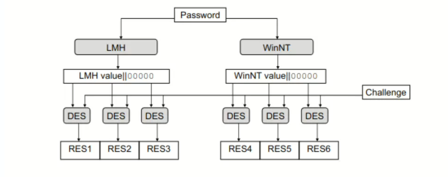
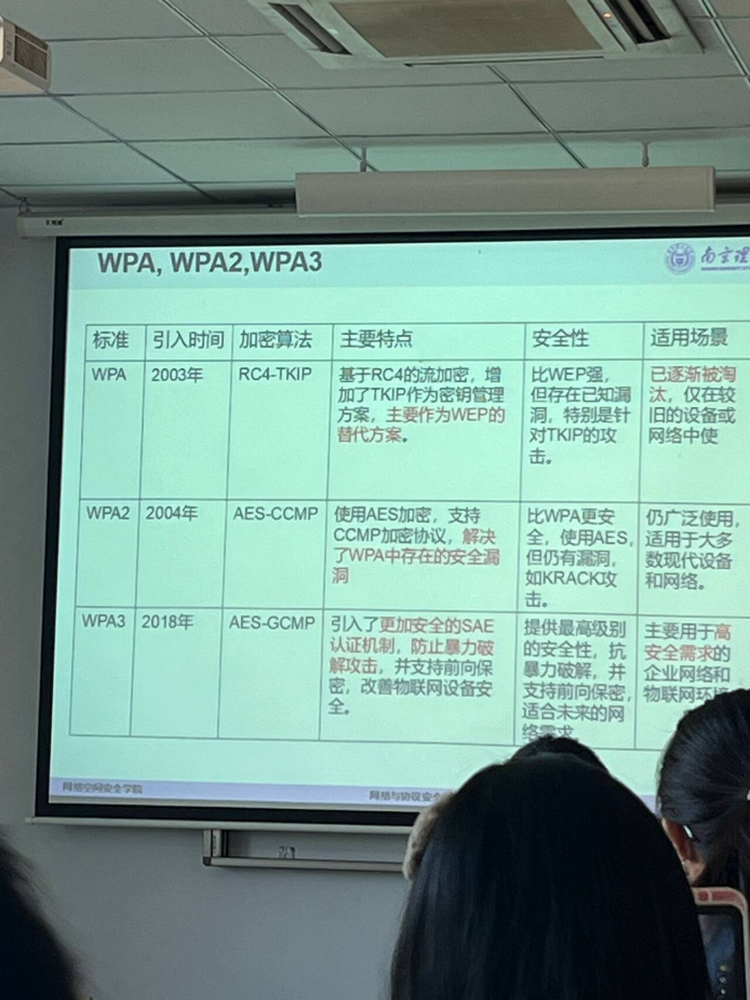
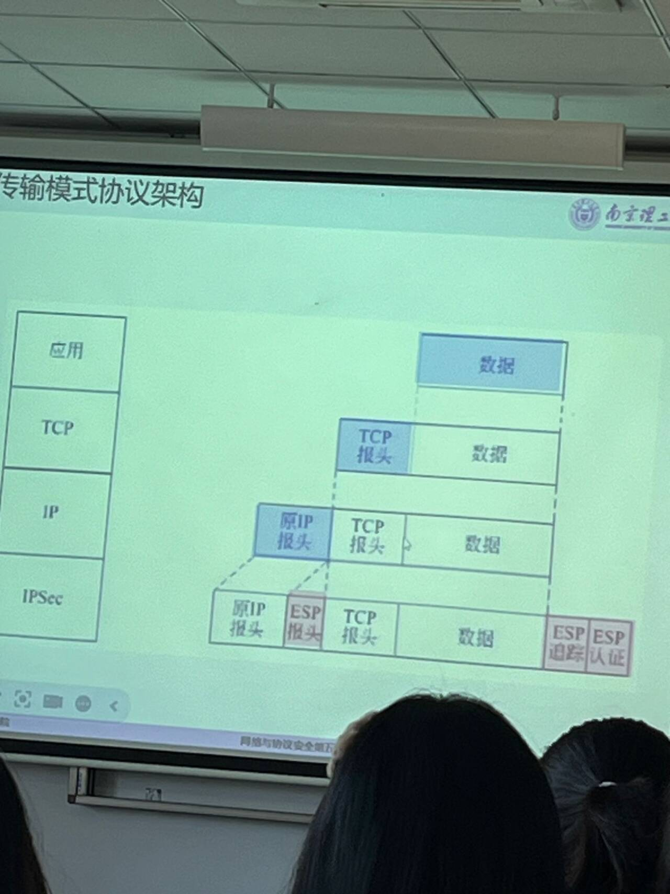

# 第一章 引入
## OSI七层模型
采用英文教材的TCP/IP模型，分为5层模型，合并物理链路层未链路层；将会话表示应用层合并为应用层。
## 攻击分类
### 被动/主动攻击
#### 被动
- 窃听；
- 搭线监听、无线截取；
看不出异常，比较隐蔽；可以使用VPN、加密技术等防范
#### 主动
主动干扰通信过程,中间人修改信息
- 假冒、重放、篡改信息、拒绝服务
- 容易检测出来，但不易防范。可以使用自动审计、入侵检测和完整性恢复等。
### 网络安全需求
对于不同协议，不同场景，安全需求不同
1. **机密性**：防止**数据未授权公开**；无关用户不能读取
2. **完整性**：防止**数据篡改**
3. **可控性**：根据数据的敏感性和应用场景，要**设置不同用户能访问的资源和信息不同**。防止未授权的用户访问限制的资源。
4. **不可否认性**：通信实体对自己收发的数据负责。
5. **可用性**：合法用户能够使用，防止**拒绝服务攻击**
### 网安协议
从**密码学角度**保证安全，也是一个通信协议
### 影响协议设计的要素
从应用层:(Web/Email...)/协议栈层次(链路层PPP....)/安全性的角度考虑
### 密码学术语与原语
#### 术语和加解密表示
#### 加密
保证数据机密性
##### 分类1：
###### 对称密码SKE
- 加解密密钥相同
- 用于加密/消息摘要MD/消息认证码
- 加密效率高，一般用对称加密进行通信而不用非对称公钥密码。Des/AES。
- 设计时的需求：$\pi = (kGen密钥生成,Enc加密算法,Dec解密算法)$
    - $KGen(|^\lambda用户输入) = k密钥$,
    - $c = Enc(k,m)$
    - $m'= Dec(k,c)$
    - 要求$m=m'$
- 在公开信道上进行协商密钥：IPSec/TLS等最核心模块，有密钥分发问题，**N个用户需要N(N-1)/2个密钥**，分发困难。可以使用D-H算法等。
###### 非对称
有公私钥
加密（公钥加密）/数字签名；
多**用于交换对称密钥**。
- $\pi = (kGen,Enc,Dec)$
    - $KGen(|^\lambda用户输入) = k_{pub}(pk),k_{pri}(sk)$,
    - 发送时加密$c = Enc(pk,m)$注意加解密时公私钥选择。
    - 接受时解密$m'= Dec(sk,c)$
    - 要求$m=m'$
##### 分类2：
###### 分组密码
将明文分为长度相同n组，每组进行对称加密。可以使用CBC等模式加密。Des/Aes
###### 流密码
对明文m生成一个等长的随机密钥k，$m \oplus k$。属于对称密码。
#### 认证
完整性+不可否认性
##### 消息摘要Message Digest
Hash散列算法，生成相同长度的摘要输出。**输入长度可变而输出长度相同**，效率高。
###### MD5(Message Digest 5)、SHA-1(Secure Hash Algorithm)
- 表征该数据特征。一般用Hash（散列函数）完成，**多个输入可能对应同一个输出**。如：校验和。
- 散列函数的要求：
    1. 单向性：快速计算出H(M)，但构造逆函数$H^-1(M)$不可行。  
    2. 抗冲突性：弱抗冲突性：给定M，计算上给不出M'，使H(M)=H(M')；强抗冲突性：找不出任何一对M,M'，使H(M)=H(M')
    3. 通常满足抗冲突性，**且抗冲突性的强度是长度一半**(128位散列值抗64位冲突，$2^{64}$次操作后才冲突)。
##### 消息认证码MAC

- $\pi = (KGen, MAC, Verify)$
- 对明文m作Hash摘要，**对称密钥**加密后放入明文消息；接收到后解密摘要，对比明文的Hash值。
- 若将(Msg|摘要D)再用对称密钥加密，就可以**同时保证机密性**。
##### 数字签名（公钥）Sig
- 确保完整性（认证）和不可否认性。
- 对消息M进行哈希得到消息摘要，将摘要用**发送方私钥**加密后放在M后。接收方接收到消息后用**发送方公钥**解密，并对比摘要内容。由于使用了发送方公私钥加解密，可以进行身份认证。
## 密钥管理
### 基于可信第三方
KDC(Key Distribution Centre)。$K_{ak}、K_{bk}$是Alice、Bob和KDC之间的共享密钥；R是密钥生成请求。

### 密钥协商算法(共享密钥生成素材)
- Diffle-Hellman（DF算法）：双方共享大素数p、发生器g。g是公开的，且总是存在W,使$g^W \mod p = Z$,Z是小于p的所有数。
- 
### 基于公钥密码体制传输对称密钥
公钥管理：共享密钥需要安全传输，一般使用公钥密码传输。
- 直接在开放信道上传输公钥有中间人攻击。使用证书分发公钥，证书授权中心（CA，Certificate Authority，可信第三方 ）负责证书包含：拥有方的公钥（需要传输）、CA私钥加密的签名。
## 协议栈
端到端：应用、传输层；点对点：网络、链路层。**越底层的安全协议能保护所有上层协议**，但一般考虑内容更多，效率更低。对于特殊的高层应用，可以只考虑对于高层的安全协议。

# 链路层拓展L2TP
链路层**主要涉及认证功能**。
## PPP
规定了帧格式+建立、配置、测试PPP链路(**链路层**)的LCP(Link Control Protocol)协议+建立、配置网络层协议的NCP(Network Control Protocol)协议。
### 功能
建立两个设备的直连通路，需要实现**数据传输、数据认证和压缩功能**。
PPP上可以传输不同网络协议的数据，NCP对这些网络协议进行配置。
### PPP协议流程

#### 包含四个阶段
##### 先建立物理连接
##### LCP链路参数配置
建立PPP链路。发送LCP配置请求报文。
##### PAP/CHAP认证用户口令
发送方提供账号+口令。验证成功回发ACK。
##### IPCP配置IP地址、NCP配置网络协议
##### LCP链路停止
##### 停止物理连接
#### 多个链路状态
None表示不需要认证。

### PPP帧格式
- 前后F表示Flag标识开头结尾。
- A表示Address，点对点协议地址固定位FF。
- C控制信息，表示帧类型和序号。
- 不同“协议”参数对应不同协议：LCP、IPCP等。
- 数据中包含了对应协议的报文。
- FCS(Frame ChuckSum)校验和。

## LCP协议：链路参数协商
### 功能
用于**建立连接与配置链路**
1. 发送Configure-Request
2. 回发ACK、NAK或Reject
### 报文代码
不同报文代码对于不同LCP协议功能

### 回复报文
ACK（均识别并接受）
NAK（均识别但部分不接受，包含不接受的项）
Reject（有未识别，包含未识别和不接受的项）
### 报文格式
#### 链路配置协议报文

类型：报文类型。
选项：在Configure-Request配置报文中，有多个选项，*可以定义最大接收单元（选项类型编号1）、使用的认证协议（3）、质量协议（4）、幻数（5，若某个PPP通信实体**发现最近发出的幻术和收到的幻数总是相同，出现了环路**）、协议压缩（7）、地址控制压缩（8）
#### 链路维护

1. Code-Reject：无法识别LCP配置报文类型字段，直接放弃链路
2. Protocol-Reject：无法识别协议字段
3. Echo-Request：测试链路质量和性能
4. Discard-Request：测试用
## IPCP协议
配置、激活、禁止一个对等PPP双方的IP模块。协商过程与LCP类似，包含Configure-Request、Configure-ACK/NAK/reject、Terminate、Code-Reject报文。
#### 选项协商+报文格式
##### 多个IP地址：选项1，不用
##### IP压缩协议：选项2，协商使用的压缩协议
##### IP地址：选项3，发送方在Request中指定一个IP地址，或者发送方不指定，接收方在回发NAK时指定。

## PAP+CHAP：身份认证Authenticate
### PAP：身份认证
PAP报文明文传输，不能防止窃听、重放、穷举攻击。**只能在链路建立阶段使用，数据通信时无法使用**。
#### 报文格式

#### 认证流程:
1. 发送Authenticate-Request
2. 服务器回发ACK/NAK
### CHAP：挑战响应
能在建立链路和数据传输时均起到认证效果。
#### 流程

认证双方都有一个秘密值$s$。
1. 认证方向认证方发送一个挑战C，包含了一个随机数$c$
2. 被认证方使用散列函数（一般是MD5），输入$s,c$，计算得到散列值$A_1$，通过Response回发。
3. 认证方接收到$A_1$后也用散列函数计算$A_2=Hash(s,c)$，对比$A_1,A_2$，相同则Success，否则Failure
#### 报文格式

类型1、2是challenge和response使用的，值包含散列值，名字包含身份描述信息
类型3、4是Success、Failure使用的。
### PPTP
是PPP的拓展协议，用于建立虚拟网络VPN。
#### 安全选项
###### PAP：没有安全保障
###### HashedPAP：使用两种特殊算法对密码进行Hash，得到两个密码的散列值，只有认证功能。
HashPAP攻击：在Hash时，将密码全部变为大写，HashedPAP使用固定的14字节密码，分成两个7字节，放入DES中并使用一个固定值作为密钥进行加密，当成一个Hash函数。当密码超过14位则丢弃，少于14位则**补0**。大大降低了字典大小。

###### MS-CHAP:利用密码的两个哈希值作为DES密钥加密Challenge，回复会收到两个Challenge的回复。
MS-CHAP攻击：在Hash时，使用两种Hash方法。16位的密码**哈希值**0padding5i位到21位，分为三部分。三部分作为密钥，和Challenge进行加密，最后结果是8bit*3=24bit。

###### MS-CHAP2：增加了双向认证

###### 然而，无论所用密码的长度或强度如何，PPTPv2始终可以被以复杂度仅为$2^56$的攻击攻破
### L2TP
#### 架构  

- 在PPP传统模式下，一个用户主机和提供网络服务的ISP的路由器之间通过调制解调器，建立了一条PPP链路。对等段就是**用户主机和ISP路由器**，通过TCP/IP协议传输PPP报文，IP报文被封装到PPP报文中传送。
- 而在L2TP中，LAC和LNS就像是调制解调器，通过协商建立隧道，转发PPP报文。当一个远程主机需要与家乡主机(某个本地主机)建立**虚拟PPP链路**，就需要让远程主机接入LAC（也可能不通过LAC，直接与LNS沟通），LAC将远程主机发送的PPP帧封装到L2TP协议中，发送给LNS，由LNS解包L2TP帧并将PPP帧发送给家乡主机。这样，对等端就是**远程主机和家乡主机**，建立了一条虚拟的点对点链路。
#### L2TP模式
##### 强制模式
远程客户通过PPP链路接入LAC，发送PPP报文并让LAC封装为L2TP报文，LAC与LNS建立L2TP隧道，LNS解包并发送到内部局域网PPP链路。
##### 自发模式
远程客户主机自行运行L2TP，直接与LNS建立隧道通信。
##### 组成
###### LAC（L2TP接入集中器Access Concentrator）
###### LNS（L2TP网络服务器Network Server）
###### 远程主机
###### 局域网
##### 消息类型
###### 数据消息，通过L2TP数据通道传输，不保证可靠传输
###### 控制消息，通过L2TP控制通道传输，保证可靠传输
##### 控制连接和会话

一条虚拟隧道对应一个控制连接，可以承载多个会话。
LAC和LNS通过协商建立一个控制连接后，隧道建立成功，承载会话。当远程主机呼叫时，建立一个会话。每个控制连接和会话都有唯一标识。
#### 建立L2TP连接过程

图中假设了LAC发起控制连接请求，实际上**LAC、LNS**都可以发起。
图中的SCCRQ(0,0)等标识中，SCCRQ标识报文类型，后面两个数字是发送、接收序号。
每次相互发送报文时，接收方收到后必须**回发ACK**，包含在回发的报文中。如果没有回发的报文，还需要发送一个ZLB ACK报文，实体长度为0。
##### 建立控制连接
LAC和LNS协商控制连接的参数，**并利用CHAP协商认证身份**。
SCC：Start Contorl Connect开始e控制连接
###### SCCRQ（类型编号1）
请求发送方发送(此处为LAC)，参数可能有
1. 成帧方式、信号类型、隧道ID等信息
2. 单一隧道需求：如果**两个对等方同时发送SCCRQ，则建立两条隧道**。若参数中包含这个，则此方获胜，另外一方放弃建立隧道请求。若同时包含，则SCCRQ取值小的取胜；取值相同都放弃。
3. **Challenge，验证对等方身份。**
###### SCCRP(类型编号2)
LNS回发SCC响应，**包含了对SCCRQ的Challenge的响应，以及对LAC的Challenge**。
###### SCCCN(SCC已建立，Complete Notify，3)：LAC回发对SCCRP的Challenge响应
##### 建立会话：
可能有呼入和呼出两种情况，不代表必须同时出现。IC:Incoming Call；OC：Outcoming Call
1. 呼入：来自远程主机的呼入请求
2. 呼出：来自LNS的会话建立请求
###### 呼入会话
1. LAC接收到远程用户的呼叫请求时，向LNS发送ICRQ请求。包含了会话建立的参数,如会话ID、被叫/主叫号码、物理链路ID等。
2. LNS收到后回发ICRP，仅包含了会话ID。
3. LAC再发送ICCN，通告一些参数:
   1. LAC收发数据最大/小速率、成帧方法、要求必须包含序号等。
   2. 另外，在L2TP的额外功能中，ICCN报文还可能包含**LAC代理为PPP远程客户和LNS之间进行认证身份的报文，包含LAC和客户之间的Challenge、Chanllenge回应（CHAP）或者Authenticate-Request的用户名密码（PAP）**
   3. **远程客户与LAC之间建立PPP连接时使用的LCP配置，包括第一个Configure-Request和最后一个Configure-Request中包含的参数**
###### 呼出会话
1. LNS向LAC发送OCRQ，包含会话ID、被叫/主叫号码、子地址等，但没有物理链路ID。
2. LAC回发OCRP，仅包含会话ID和物理链路ID
3. LNS回发OCCN，包含一些参数(收发数据最大/小速率、成帧方法、要求必须包含序号等)
4. 注意回发0实体长度确认ZLB ACK
##### 数据传输
**远程客户将自己的PPP帧发送给LAC，LAC封装为L2TP报文并在建立的隧道上发送给LNS，LNS解包为PPP帧发送给目标。**
##### 终止会话
LAC或LNS发送一个CDN(Call Disconnect Notify，呼叫断链通告)报文，包含会话ID，结果代码，错误代码。发送后直接清除该会话资源。另一方收到后回发ZLB ACKa并清除资源。
##### 终止控制连接
LAC或LNS发送一个Stop CCN（Stop Control Connection Notify，终止控制连接通告），包含隧道ID、结果代码和错误代码。
#### L2TP额外功能
###### 确保连接有效的HELLO报文，用于活动性检测，仍然活动则回发ACK，否则清除隧道。
###### LNS需要修改参数配置时，向LAC发送SLI(Set Link Info)。
#### L2TP保证数据可靠性
**L2TP基于UDP（传输层）**，本身不保证数据可靠传输。
但由于每个报文有对应序号ID，保证不会乱序。且每个报文接收到后都一定要回发ACK确认，防止丢包。
L2TP还使用滑动窗口技术保证船速速率稳定。
使用慢启动策略防止拥塞。
#### 报文格式
##### 报文头部

包含设置的T（Type）、L等，还有长度（控制信息必须包含）、隧道，会话ID、发送/接收方序号Ns，Nr，表示此报文是第几个接收的，从0开始。
##### 负载
T:Type，0标识数据消息，1标识控制消息。
###### 会话消息：L2TP帧
###### 控制消息：AVP帧

**L2TP控制报文中的所有参数都以AVP帧存在**。如SCCRQ的“成帧方法AVP”。
- M表示强制位，当接收方收到一个M=1，但不可识别的AVP帧后，相关隧道或会话立刻终止。M=0则忽略。
- H:隐藏位，表示属性值是否被隐藏。

#### L2TP安全性分析
L2TP未提供PPP数据加密和完整性保护，若使用CHAP则仅提供身份认证。可能有地址欺骗、插入攻击、拒绝服务攻击等危险。应与IP安全如IPSec合用。
## EAP协议框架Extensible Authentication Protocol
**封装了很多在客户端和认证服务器之间的认证方式**。可以在不同链路层和网络层协议中提供认证框架，以提供认证服务。

# 无线局域网安全
无线局域网信道开放，容易被窃听和修改转发。
常用的安全协议：
## 要掌握
- 什么是无线局域网
- WEP模式
- 知道现在用的是WPA，国际上是802.11，我国是WAPI。
## 无线局域网
### 局域网
#### 定义
局域网（LAN）**用于连接空间上相邻的设备**。这些设备共享一个物理通信介质（如铜线、光纤、射频）。可以通过媒体访问控制（MAC）地址将数据发送到特定设备。MAC地址在生产过程中写入，具有全球唯一性。
#### 协议
IEEE802.3以太网比较成功，使用相对无序机制，局域网中的每个设备都可以随时发送消息，若遇到冲突则所有设备一起解决，主要方法是随机等待一段时间重发。
#### 可能存在攻击
ARP欺骗、使用网卡设置的模式来嗅探所有数据
### 无线局域网
国际上由IEEE802.11定义。定义了无线传输协议、频率范围、网络和网络组件、国家特点、安全(**IEEE802.11i**)等。介质是特定频段，遇到冲突时解决办法同局域网。接入可以是移动设备和某个接入点（基础设施模式）或两个移动设备之间（自组网模式）。
#### 安全机制
###### 简单安全机制：MAC白名单
###### 服务集标识符SSID
某个接入接入点的设备有SSID，接入点一直向外广播此SSID，以便其他设备识别，可以禁止SSID广播。
## 有限等效加密WEP
Wire Equivalent Privacy，有线等效加密，旨在提供像有线局域网那样的安全。
### 加密和完整性验证：

###### 加密算法：RC4，流密码加密
移动设备和接入点需要共享一个密钥K(40或104bit)，WEP没有密钥管理，需要手动输入。
###### 完整性：CRC32
#### 密钥模式
需要40位密钥+24位随机IV生成64bit或104位密钥+24为随机IV生成128bit。
###### ASCII模式：输入5个ASCII字符（64）或13个ASCII字符（128）
###### HEX模式：十六进制模式，只能输入A-F、0-9
#### 加密WLAN包过程
###### 对WLAN包进行CRC校验，CRC校验是线性的，会有攻击
###### 生成一个24位IV初始向量，和秘密密钥一起组成流密钥
###### 根据密钥K|IV生成伪随机密钥流，长度为WLAN包|CRC校验长度
###### 伪随机密钥流和WLAN|CRC异或加密，头上拼接IV发送
#### 数据处理过程

#### WEP加密种类
WE只保护802.11MAC的有效载荷。一旦使用WEP加密，则一个帧会多出8字节。3字节IV，6位填充，2位密码标识符，4字节的FCS帧校验和。
###### 单播密钥，密钥种类0，工作站和接入点共享，保护单播
###### 默认密钥，密钥种类1，工作站之间共享，保护广播和组播
### WEP认证
#### 开放系统认证
不认证，工作站直接发送Authenticate Request，接入点回发Authenticate Response
#### 共享密钥认证
**基于Challenge**。工作站发送Authenticate Request，接入点回发一个随机数Challenge，工作站用预共享的密钥进行RC4加密，响应Challenge后才成功回发Authenticate Response

### WEP不足
密钥长度只有40位，且不能复用（利用重复IV）。容易被推测出秘密数据。使用线性CRC校验。
###### 只要知道一个明文，那么使用对应的所有IV的密文都会被解密：已知明文攻击。
###### 流加密有易变性，且CRC校验是线性的。
对于一个明文$m_1$，翻转某个位置$p$，密文中对应位置也一定会翻转。然而由于CRC的线性，导致了$m_1|CRC(m_1) \oplus m_2|CRC(m_2) = (m_1 \oplus m_2) | (CRC(m_1) \oplus CRC(m_2))$,即CRC校验检测不出这种修改。
## Wifi保护访问WPA 
WIFI Protected Access，有WPA1、2、3三个版本。是WEP在802.11ia实现前的过度。
### WPA1-3的不同特点表（GCMP未详细介绍）

### WPA加密
**使用TKIP协议进行密钥管理。**
### TKIP协议临时密钥完整性协议：用于密钥管理，生成密钥
Temporol Key Integrity Protocol，是对WEP的改进。
#### 改进之处
###### 1.需要多个主密钥，对每个帧加密时的密钥使用主密钥派生的子密钥。
###### 2.使用新的完整性校验MIC(Michale Integrity Code，麦克消息完整性代码，需要MIC密钥)，完整性校验失败的对策
###### 3.每个帧给标号
###### 4.使用扩展48位IV，作为计数器和IV，每当新的主密钥部署后设置为1
###### 5.密钥重新获取和分发
#### 密钥生成
一阶段使用传输地址和WLAN包的序列号作为输入混淆。二阶段使用WLAN包序列号混淆。
密钥生成方式
#### 数据处理
需要1.需要加密的Payload。2.主密钥（暂时密钥）3.MIC完整性校验密钥 4.发送端地址 5.计数器计数的序列号。

### WPA认证
#### 基于802.1x协议认证
有认证服务器时选择。
#### 基于PSG预共享密钥认证
个人认证。
#### CCMP
802.11i规定的一个基于AES加密算法的CCMP(计数模式/CBC-MAC，利用带有计数器的AES实现加密，CBC-MAC完整性认证）
### 802.1X
是一个链路层协议。
定义了一个**基于端口**的网络控制标准，主要用于WLAN。定义了一个基于LAN的EAP框架下的转发。EAPoL。认证请求方和认证者之间通过EAP消息，让认证服务器进行身份认证，通过后认证者才打开802.1X的受控端口。
#### 功能
对于访问局域网的用户进行认证，确保合法用户接入
#### 过程
有两个端口：受控端口（认证通过才打开）和非受控端口（对所有用户打开，接受认证信息）
### WAPI
对应美国的802.11i，**是中国的无线局域网协议**。简略介绍
### WLAN认证
设备接入网络之前，对接入的设备进行身份认证和数据加密。
#### 链路认证
1. 开放系统认证：本质上不认证
2. 共享密钥认证：基于挑战来认证，客户端服务器之间共享密钥。服务器发送随机数chanllenge.
#### 用户认证
1. PSK模式(预共享密钥)：需要在无线设备和接入点配置相同的预共享密钥。密钥相同则通过认证。
2. MAC地址认证:基于端口和MAC地址。在接入设备上设置MAC白名单。
3. 802.1x认证：基于端口的网络接入认证。

# 蜂窝网络安全
移动通信架构，将服务区划分为正六边形，高速率、高容量、低时延、低能耗。**链路层**。2G：GSM(Global System for Mobile)、3G：UMTS(Universal Mobile Telecommunication System)、4G：LTE(Long Term Evolution)、5G
### 蜂窝网络架构

#### 设备：
一个设备（手机、电脑、导航系统等）+ 一张智能卡（SIM卡或集成的电路）。认证信息存储在SIM卡中。
1. 2G设备GSM：移动站+SIM卡，有唯一标识IMSI和定期更换的标识TMSI，防止位置跟踪
2. 3G设备UMTS：移动系统+USIM卡
3. 之后：移动设备+UICC通用集成电路卡
#### 基站
GSM：基站
UMTS：UTRAN
LTE：E-UTRAN
#### 加密算法
GSM：A5
UMTS：f8f9
ELT：Snow 3G、AES、ZUC
#### 服务提供设备
移动设备当前连接的基站由**访问位置寄存器（VLR Visitor Location）管理**
客户的合同数据存储在**归属位置寄存器（HLR Home Location）**
加密参数保存在**认证中心（Authenticate Center Auc）和SIM卡中**
### 2G技术GSM
GSMs主要目的是获得和有线电话一样的安全级别，所以主要关注移动站设备和基站之间的传播路径，保证用户认证和数据加密。
#### 组成和通信过程

##### 基站子系统BSS：负责提供和管理工作站 与 网络和交换子系统设备 间的传输路径。
###### 基站控制器BSC Base Station Controller
管理设备，管理BTS，负责端口分配、信道分配和管理
###### 基站收发台BTS Base Trans Station
传输设备，由天线等组成
##### 网络和交换子系统
###### 访问位置寄存器(VLR)、归属位置寄存器(HLR)
###### AuC
##### 位置登记过程

#### 安全架构

##### 认证过程
SIM卡中有：国际移动用户标识码IMSI（International Mobile Subscriber Identity）和暂时标识TMSI(Temperal)，私有密钥K
###### 挑战响应
1. 当某个移动站想要接入基站网络时，首先向基站发送自己的TMSI。
2. 运营商生成一个随机数RAND发送给基站，基站转发给移动站。
3. 移动站SIM卡收到后根据自己的私有K、RAND和认证算法A3计算出一个签名回应SRES（Signed RESpond）
4. 运营商通过查询AuC中的TMSI找到对应IMSI，进一步找到A3和K，同样计算一个SRES'，看是否相等
###### 密钥派生
在**密钥派生算法A8中**，SIM卡和AuC使用私有密钥$K_i$和随机数RAND生成会话密钥$K_c$。在A5加密算法中，**用$K_c$生成密钥流对通信进行加密**。$K_c$还可以用于生成TMSI。
###### 漫游
外国网络供应商无需了解SIM卡中的A3、A8算法。本地AuC首先计算多个三元组（RAND，SRES，$K_c$），在外国，**AuC**将SIM卡的IMSI和三元组发送给当地供应商A，A选择一个三元组的RAND进行挑战响应，若得到的SRES和三元组的SRES相同，则成功，使用$K_c$进行会话加密。
###### GSM Catchera中间人不加密攻击
移动站接入的基站永远是信号最强的，就可以使用未经授权的基站进行攻击。中间人收到RAND随机数后向移动站发送RAND、noENC不加密标记，要求整个通信过程不加密。

###### GSM降级攻击
如果默认就启用了加密，那不加密攻击失效。此时由于A5算法的弱点，可以利用一小段通信计算出$K_c$。当运营商发送RAND挑战，中间基站就向移动站发送RAND，**并指定一个A5算法**，移动站回复了SRES后，可以迟几毫秒发送，先解出$K_c$，之后的通信就可以解密。
### UMTS和LTE
#### UMTS

UMTS是GMS的继承，**漫游是常态**。
服务网络SN(Service Network)：为移动设备提供蜂窝网络接入
家庭环境HE(Home Enviroment)：本地提供商。**加密参数仅在USIM和HE之间通信**。
##### UMTS的功能
UMTS即向后兼容GMS，也有对GMS漏洞的修复。
###### 已有功能

###### 新加入功能

##### UMTS认证

对GSM的挑战响应作扩展。
###### 需要的参数
MAC消息认证码：用于认证HE
SQN（Sequence Number）：序列码，防止重放攻击
USIM控制字段AMF：用于在安全通道中控制USIM
IK(Integrity Key)完整性密钥：保证数据完整性
###### 过程
1. HE计算序列号、MAC和派生密钥
2. SN仅负责转发挑战信息RAND和完整性字段AUTH（MAC和IK）
3. USIM验证MAC，并响应RAND给**SN**
4. SN验证USIM
5. 用会话密钥CK和f8加密函数加密，IK和f9完整性验证(f8f9需要标准化)
### LTE和5G
对于IMSI捕捉器来说，没有中间人和

# 认证协议Kerberos
主要面向**实体身份认证**
- 对称密码、可信第三方、票据Ticket。用户访问服务器之前必须使用对称密码通过可信第三方获得票据后才可以通信。
## 认证过程
- 
- 用户：Client c，持有密钥$\{K_{AS,c},K_{c,tgs}(由AS生成),K_{c,v}(由tgs生成)\}$。
- 可信第三方(KDC):
    - 认证服务器:AS，持有密钥$\{K_{AS,c}(预先存储),K_{AS,tgs(用于告知tgs所生成的K_{c,tgs})}\}$。验证用户c的身份，并发放票据许可票据TGT。
    - 票据签发服务器Ticket Granting Server(tgs)。持有密钥$\{K_{c,tgs}（AS生成后告知）,K_{v,tgs}(用于告知服务器V生成的K_{c,v})\}$
- 服务器：V，持有密钥$\{K_{c,v}(由tgs生成并告知),K_{tgs,v}\}$

1. 客户端c向AS认证服务器**直接发送**$\{ID_c(自己的身份id),ID_tgs(要访问的tgs的id),TS_1(时间戳)\,n_1(某个随机数)}$
2. AS收到后查询$ID_c$的密钥$K_{AS,c}$，并加密发送：
    1. 时间戳$TS_2$
    2. TGT(票据许可Ticket，tgs可解密):$E_{K_{AS,tgs}}(K_{c,tgs}(用于用户和tgs通信，tgs收到用户发送的票据后即可解密出),TS_2,ID_c)$
    3. ct1用户信息(用户可解密):$E_{K_{AS,c}}(K_{c,tgs},TS_2,ID_{tgs}(确认tgs),n_1)$
3. 客户端收到后解密ct1，验证$ID_{tgs}、n_1、TS_2$。向tgs发送:
    1. TGT
    2. 请求的服务器$ID_V$
    3. ct2:$E_{K_{c,tgs}}(ID_c,TS_3)$
    4. $n_2$随机数
4. tgs收到后生成一个c、v通信密钥$K_{c,v}$;解密TGT来获取$K_{c,tgs},ID_c,TS_2$，并验证$TS_2$。用得到的$K_{c,tgs}$解密ct2得到${ID_C}^{'}和TS_3$，验证之。并向客户端c回发：
    1. 票据STicket:$E_{K_{tgs,v}}(K_{c,v},Id_c,TS_4)$
    2. ct3用户信息:$E_{K_{c,tgs}}(K_{c,v},ID_v,TS_4,n_3)$
    3. $Id_c$
5. 用户收到后解密ct3，验证$TS_4,n_3,Id_v$。向服务器发送：
    1. 票据ST
    2. ct4：$E_{K_{c,v}}(id_c,TS_5)$
6. 服务器收到后解密ST，ct4；验证ST中的$TS_4$和ct4中的$Id_c和TS_5$。若成功则设置状态ACCEPT。回发ct5:$E_{K_{c,v}}(ST_6)$
7. 收到ct5后验证$ST_6$，并设置ACCEPT，开始通信。
## 票据与认证符
1. 初始认证选项：
    - INITAL：无身份认证，若用户拥有$K_{c,AS}$则身份认证了
    - PRE-AUTHENT：要求用户请求AS前提供预认证；用自己的证书私钥加密本地时间戳。
    - HW-AUTHENT；HARDWARE-AUTH：硬件支持的预认证
2. 可更新票据：
    - RENEWABLE，设置两个生命周期，一个是票据生命周期，一个是更新生命周期。**在更新周期内可以设置RENEW选项来请求KDC获取新的票据，新的票据有新的密钥和生命周期**。
    - RENEABLE-OK：若客户端请求的生命周期得不到满足也能接受。
3. 可推迟票据：用户待会儿再用。在AS请求报文中增加ALLOW-POSTDATE，获取MAY-POSTDATE的TGT，再获取POSTDATED的票据。使用POSTDATED票据时需要请求KDC激活。（要加入INVALID和VALIDATE选项）
4. 无效票据：INVALID、VALIDATE
5. 代理功能：客户端请求一个代理为其完成对服务器的访问。在TGT中包含PROXIABLE，并指明代理的IP地址。ST中包含Proxy选项。
- 
- 

# SSH协议（协议以及内部流程，指令。指令具体不要求）
应用层协议，基于TCP端口22。机密性、完整性保护和身份认证。低层实现用户名口令加密保护数据；高层同时实现证书身份认证。
Secure Shell：安全命令解释器。提供账号
## 协议组成和功能
1. 传输层协议：协商，数据处理，规定各种加密、认证、散列等算法协商的报文格式和顺序。定义了密钥计算、数据处理方法。定义主机级（一个主机多个用户）身份认证。SSH最底层。包含了服务器身份认证。
2. 用户身份认证
3. 连接协议：分解安全通道到多个逻辑通道，**多个高层应用共享SSH安全服务**
- 高层应用FTP等 ← SSH连接协议 ← SSH用户认证 ← SSH传输层协议 ← TCP ← IP
## SSH数据类型和表示
SSH使用类似编程语言的格式来组成报文。
- 数据类型：
    1. 整数（单字节、32、64B）
    2. 布尔值01
    3. 字符串、大整数、列表：4B长度标识+字符串/大整数
- 算法描述：使用字符串表示，使用“列表”存储，如0 0 0 21 3 d e s - ....
## SSH传输协议
- SSH流程：首先TCP三次握手在22号端口建立连接
    1. 版本协商：有版本兼容问题。若服务器可以向下兼容，则向客户端发送版本1.99，且不包含CR换行符；收到客户端回应后服务器选择合适版本。
    2. 密钥交换
        支持预共享密钥(隐式，报文中包含密钥的MAC)、数字签名(显示)两种方式。默认显式，需要服务器公钥（主机密钥Host Key）。可以维护服务器/公钥对，或使用CA颁发的证书，本地保存CA的公钥。
        1. 算法协商：其中的多个列表表示发送方建议，先出现的优先级高。若客户端和服务器的列表第一项相同则采用第一项，**若不同则向后匹配且以客户端优先。**
        
        2. DH交换：客户端发送DH公开数$d^a mod p$，收到后服务器返回：
            - 证书，实现了身份认证
            - DH公开数$d^b mod p$
            - 基于客户端和服务器信息(握手消息)的散列函数H经过证书私钥签名后的值。H可以作为数字签名，计算密钥、作为会话ID（防止重放攻击）。
        3. 计算密钥：类似SSL，使用共享DH交换的密钥K和散列H值计算，使用散列函数(SHA等)拼接KH和字符串等进行计算。c->s、s->c两方向密钥不同，若为分组密码则要计算IV。
        4. 服务器通知客户端使用密钥。
    3. 开始服务。客户端发送需要的服务请求，若接受服务器回发ACCEPT，否则DISCONNECTED（通信过程中出现问题都返回DISCONNECTED）。
    - 
- 报文格式
## 身份认证协议SSH
## SSH连接协议
传输层协议建立连接称为隧道，多个应用相互连接称为通道。一个隧道包含多个通道，即SSH连接可以**为多个应用提供安全服务**。
### 基本通道操作

1. SSH-MESSAGE-CHANNEL_OPEN

## SSH应用
- SFTP
- 基于SSH的VPN
- SSH产品

# DNS安全
## DNS
域名解析，实际是维护一张表格。 
- 域名命名：域名树，根节点顶级域(com)，二级域...总名字就是叶子节点回溯到根节点的名称序列，中间用.分割。如:com -> baidu -> www，连接www.baidu.com。
- 每个服务器负责维护一个子域。授权：负责大区域的服务器可以授权其他服务器负责维护其他子域。
- 
- 每个客户端仅需记录1-2个DNS服务器：每个服务器都知道上级/根DNS服务器地址；根DNS知道所有二级DNS服务器IP地址。
- 查询：
    1. 递归查询：客户默认DNS代理查询，有Cache则返回，没有则递归向上请求域名；
    2. 迭代查询；向上级请求可能存在Cache的服务器。
- DNS报文：ID 参数 问题、答案、权威数 附加记录数
    1. 问题区：查询域名、查询类型、查询类
    2. 答案区、权威区(授权服务器信息)、附加信息区
    3. 
    4. 
## DNS欺骗
- 中间人攻击：欺骗DNS响应报文，匹配ID和UDP端口即可
    - DNS欺骗
    - 猜测ID和UDP：伪造自己的IP地址为合法服务器地址；猜测ID和客户端UDP进行穷举
- DNS劫持：侵入DNS服务器，修改数据库
- 生日攻击：寻找16bit字符串(UDP端口),则碰撞攻击的复杂度通过生日攻击可以降到$2^8$个查询(即bit长度的一半)
- 名字连锁攻击：修改权威区、附加信息区(将恶意字段放在附加信息中，例如将恶意IP放入附加信息区，此后对正常的网址的访问会重定向到恶意IP)。
- 信任服务器背板：默认DNS服务器通过DHCP协议分配IP时，劫持DHCP服务器
- 否认合法域名存在
- 通配符:导致域名名称标识存在不确定性
- Kaminski攻击：利用不存在域名
## DNSSec协议
- DNS欺骗都是将正常请求定向到恶意网站，第一种是伪装DNS服务器，第二种是篡改DNS响应报文。则加入**认证机制**即可。**DNSsec使用数字签名提供身份认证和完整性校验，同时还有公钥分发技术。**，但没有Dos防护。
- DNSsec的拓展以资源记录RR形式保存，便于向后兼容和扩展性。
### 密钥使用
- 域签名密钥ZSK、密钥签名密钥KSK：
    1. 每个区域为每个算法配置一对公私钥(ZSK Zone Signing Key)
    2. 客户端验证签名用到DNS服务器的公钥，直接配置在DNS服务器或传输，使用另一对密钥进行签名(KSK Key Siging Key)。
    - 解析example.com域名，请求a.example.com时，收到一个标准DNS响应记录，和一个RRSIG记录(对example.com域的签名)，用example.com的私钥签名；再请求ZSK的公钥，则返回DNSKEY记录，使用KSK私钥签名的ZSK。
    - 使用认证链来进行认证。**一个域的公钥通过父域认证**。
- DNSKEY报文：标志(0-15 第7bit设置为1时表示区域密钥，则公钥属于当前域 第15bit表示安全入口点，为1时区域密钥必须为1) 协议(必须设置为3) 算法 公钥
- RRSIG：覆盖的类型：被签名的资源记录类型；原始TT：签名有效期。。存有ZSK私钥加密的签名，需要KSK私钥签名的公钥报文DNSKEY来认证这个RRSIG签名。
- DS：指示子域的DNSKEY资源记录，保存对于DNSKEY的密钥标签、签名算法和摘要
- NSEC：保存下一个域名和类型比特位图(表示当前RR的类型)。循环式存储，首先按照资源信息重要性排序，之后形成域名链，最后会回到第一个域名结束。

### DNSsec对DNS扩展
1. CName记录：域名的别名，要求必须包含一个RRSIG
2. DNS报文：报文中加入新参数
3. 增加参数字段进行扩展
4. 伪资源记录：报文长度增加后可能不能使用UDP，修改之

# 电子邮件协议
## RFC822
## PEM电子邮件加密
- 加密+认证
## MIME
- 数据格式
- 邮件兼容性Radix-64：原始二进制中三字节（24bit）以每6bit分割，首两位补0，得到4个新的ASCII字符。
## S/MIME
- 安全性：
    - 加密：AES+CBC(CBC具有延展性，存在修改密文邮件攻击和密文规律)
    - 认证：RSA+SHA-256的数字签名。
    - 发送：一个消息Msg，用SHA-256生成Hash摘要后用发送方的私钥加密，将这个签名D放在Msg后；生成一个AES一次对称密钥，加密(Msg+D)，再用发送方的私钥加密这个对称密钥K'，放在加密消息的头上(K'+Msg+D)
    - 接受：发送方私钥解密出对称密钥K，解密(Msg+D)，用发送方私钥解密D，得到消息摘要；对比SHA-256(Msg)和D，验证签名
- 功能
    1. Enveloped data：仅加密
    2. Signed data:Base64(数据+签名)
    3. Clear-Signed data:数据+Base64(签名)
    4. Signed and enveloped data：加密+签名
    仅签名的信息用于发送公钥证书，交换公钥。
- 选择密码算法：
    1. 发送方保存了接收方可接受的密码算法列表，则选择最优先的
    2. 没有列表，但曾经有通信过，则使用旧算法
    3. 使用保守算法如3-DES
- 增加的消息类型：
    1. Multipart - Signed：一个clear-Signed消息
    2. Application：pkcs7-mimie-signedData签名消息/enveloped-data加密消息/DegeneratesignedData仅公钥证书/CompressedData压缩
- S/MIME认证机制：Class1：名字，邮箱地址确认，加解密软件；Class2：+注册信息、地址确认，加解密软件；Class3：个人现场确认，企业商业记录，加解密硬件。PCA均为可信硬件；
## PGP
- 加密/认证/加密和认证
## 攻击
1. 窃听SMTP传输（TLS加密解决）
2. 运行自己的SMTP服务器或攻击SMTP
3. 攻击IMAP服务器，获取其用户名密码
- EFAIL：漏洞邮件服务器，破坏加密：
    1. 攻击者劫持加密邮件c
    2. 修改邮件源代码： 
        1. 将c嵌入更大的未加密multipart中
        2. 修改c为c'
    3. 修改后的c'发送给原发送方/接收方
    4. 监听受害者邮件客户端和攻击者控制的服务器
    5. 当接收到c'方解密后，漏洞客户端后门泄露c'明文给攻击者，进行统计分析。
- EFAIL2：未签名的内容当成已签名的内容
    1. Gui伪造：伪造签名成功后的Gui图标
    2. MIME地址匹配脆弱：客户端对RFC822地址不严格处理，MIME头地址字段可以修改。如果客户端中不显示原始的邮箱地址而只显示昵称/别名，则攻击者可以利用相同昵称的证书来进行签名。
    3. 部分签名：利用部分签名的邮件，攻击者篡改未签名的部分。
    4. CMS：将合法签名的MIME实体嵌入到邮件中，修改CMS明签名。
- EFAIL3：客户端自动加解密
    1. 发送一个加密MIME邮件（加入不可显示字符）发送给受害者
    2. 诱导受害者回复该邮件，将解密的明文插入回复邮件

# 复习总结

## **IPSec**
### IP协议
- IP数据包：IP|TPC|数据
### IPSec 概述
需要在IP层实现认证（完整性）、加密（机密性）。密钥管理
- 结构：
    - 体系结构RFC4301
    - 认证报头AH
    - 封装安全载荷ESP
    - 因特网密钥交换IKE
    - 密码算法
#### 协议组成

1. 协商阶段
2. 数据交互阶段
- 安全方法：
    - IKE：协商阶段
    - AH报头：只提供认证，不做加密，
    - ESP
- 安全关联数据库；SAD
- 安全关联SA：
    1. 组成：SPI安全参数索引、IP目的地址、安全协议标识符。单个SA实现AH或ESP协议。
    2. 多个SA组合方式：
    3. 安全策略SP选择方式：
- 安全策略数据库：SPD
- 软件模块： AH+ESP模块：AH和ESP由SAD、SPD同时决定。
#### IP包传输加密方式
#### IPSec数据格式
- 两种数据格式：AH、ESP（数据加密）+两种模式下的两种报文格式
- 两种模式
    1. 传输模式：仅加密载荷不加密IP地址，仅保护部分，主机到主机。
        - 报文格式
        - 传输方式
    2. 隧道模式：整个IP数据包都被加密，并插入新的IP数据包中。用于网关应用。
- ESP报文：
    1. 传输模式
    2. 隧道模式
### IPSec 密钥协商管理IKE
#### 原始ISAKMP
基于UDP协议，端口号5000。
- 完成：
    1. 定义对等端身份认证，安全关联创建管理、密钥生成
    2. 建立协商更改删除SA的步骤和报文格式
    3. 定义密钥交换和认证载荷
- 交换方式：协商SA、密钥生成、身份认证。
    1. 基本交换,未身份保护，同时密钥协商和身份保护：
    2. 身份保护交换，拆开密钥协商和身份认证，先协商密钥再发送加密的身份：
    3. 只有认证的交换
    4. 野蛮交换
    5. 维护性交换：通知交换
- 报文和载荷
#### IKE
- 协商SA、密钥生成、身份认证。
    - 协商SA：两种模式：主模式（身份保护交换）、野蛮模式（野蛮交换）
    - 密钥交换：快速模式
    - 身份认证
- 身份认证方法：
    1. 公钥加密
    2. 数字签名
    3. 改进公钥加密：堆成密钥加密，对称密钥使用公钥加密
    4. 预共享密钥
- 主模式：
    1. 数字签名认证P88
    2. 公钥加密P89
- 野蛮模式：P91
- 快速模式P92
- IKEv1阶段：

    1. 第一阶段:指定密钥算法。主模式/野蛮模式流程：英文书
    2. 第二阶段:使用密码算法调用ESP和AH字段
- IKEv2阶段：两阶段嵌套在一起，协商过程中即开始数据转发。
- NAT穿越
## **SSL/TLS**

### 体系架构

1. **握手协议**
2. **记录协议**
3. 更改密码规范协议：通告
4. 警告协议：报错+断连
### SSLV3
#### 协议流程
P121。
- 会话恢复
- 客户端认证流程...
#### 多个协议报文和代码标识
- 握手协议
- 记录协议
- 更改密码协议
- 警告协议
### TLS1.2
提供保密性+数据完整性。`
- 握手协议
- 记录协议：传输层中，先切片再压缩，再完整性认证。
- 更改密码协议
- 警告协议
#### 协议流程
会话握手协议完整流程：
1. 阶段一
2. 阶段二
3. 阶段三细节
    1. 密钥计算过程
### TLS1.3
改变：密码算法升级；简化握手阶段的交互方式，更加简洁。
- 0RTT模式：预共享密钥
- 密钥协商
#### 数据报文格式+各个报文中参数含义    
## Web安全
没有展开很多
### HTTP概述
1. 报文格式ASCII码
2. HTML语言、HTTP传输协议（TCP）
3. 安全性：认证阶段增强
    - basic方式
    - 消息摘要方式
    - 基于密码的认证方式：HTML表单。basic方式区别：密码传输的位置,basic表头。
### HTTPS 
HTTP明文传输；HTTPS在传输层调用SSL/TLS协议，加密传输。有数据加密、身份认证、密钥生成。
- HTTPS 工作原理+流程
## Kerberos
### 设计思路
- 认证服务器AS（票据许可票据），票据授权服务器TGS（票据）
### 协议流程
## SSH
### 协议组成
1. 传输层协议：协商密钥算法
2. 用户认证协议
3. 连接协议
### 传输协议
版本交换、密钥交换（算法协商、D-H交换、密钥计算）
- 协议流程
- 报文格式
- 密钥生成过程
### 认证协议：
1. 公钥认证
2. 口令认证：
    - 键盘交互认证方法键入口令
### 连接协议
通道转发等
## DNS
网址和IP地址间映射。
### DNS欺骗攻击(安全威胁)
主要原因：查询IP时没有认证机制。
### DNSSec
主要做数据源发认证和完整性验证。
### 密钥使用、数字签名、数据格式
## 文件加密PGP
公钥加密认证。
### PGP系统
### OpenPGP
## 邮件S/MIME
