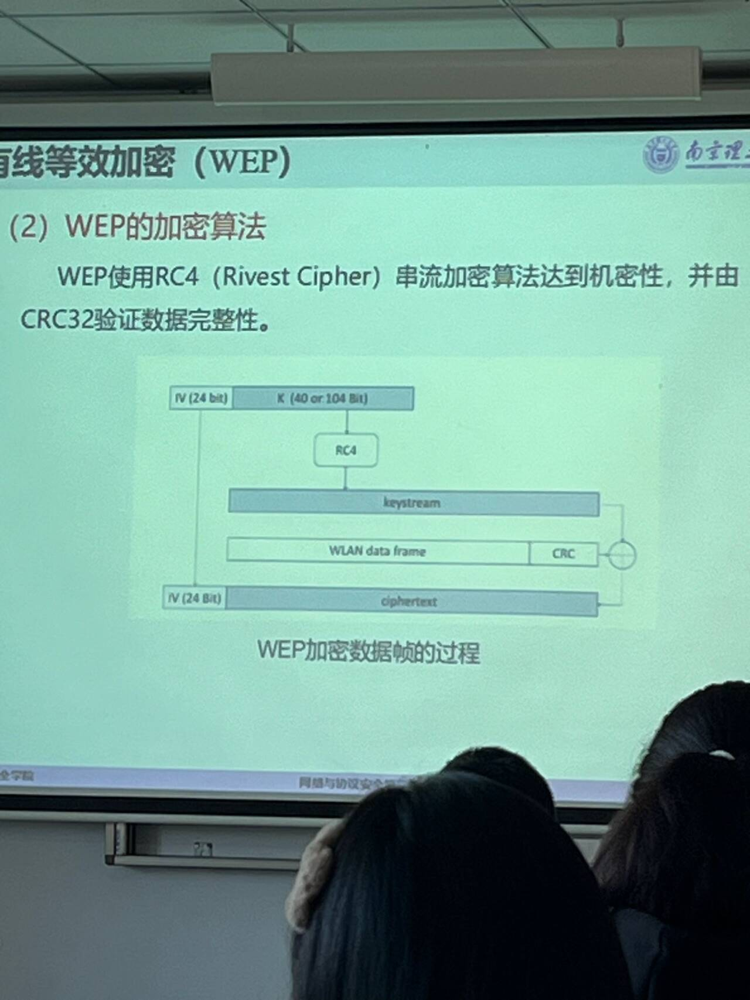

# 概论
# 第一章 引入
## TCP/IP中的安全隐患
应用层、传输层、网络层、链路层
1. 信息嗅探:
    - 在交换式网络环境中，ARP地址解析协议存在隐患。ARP协议负责动态解析IP地址与物理MAC地址，缓存中存储$IP_a/MAC_a$
    - 当$AB$双方通信时，只要偷听方$H$截获所有保文，并修改ARP应答报文为$IP_A/MAC_H$和$IP_B/MAC_H$即可。$H$在偷听到信息后重发即可。
2. 信息篡改： 
   - $H$嗅探信息后重放时可以选择修改数据，增加木马病毒等。
3. 身份欺骗
   - IP欺骗、DNS欺骗
4. 行为否认
   - 发送方否认自己已经发送过数据，或接收方否认自己收到了数据的行为。
   - 例如IP欺骗，发送方使用假IP发送数据。
## 网络安全需求
- 机密性：防止偷听
- 完整性：防止篡改
- 可控性：防止未授权的访问和修改。标识、鉴别、授权、决策、执行。**访问控制**:首先赋予每一个通信实体唯一的标识和访问权限，访问时先验证身份后执行相应访问控制策略。
- 不可否认性:不可抵赖。
- 可用性：合法用户需要使用时能够使用：DDos等拒绝服务攻击。
## 构建网络安全协议需要的组件**(密码原语)**
1. 加解密(机密性)：公钥密码（非对称，RSA、数字签名算法DSA、椭圆曲线算法ECC）和私钥密码（对称，AES、3DES、IDEA、RC2、RC4）。
2. 消息摘要(完整性)：
    - MD5(Message Digest 5)、SHA-1(Secure Hash Algorithm)
    - 表征该数据特征。一般用Hash（散列函数）完成，**多个输入可能对应同一个输出**。如：校验和。
    - 散列函数的要求：
        2. 单向性：快速计算出H(M)，但构造逆函数$H^-1(M)$不可行。  
        3. 抗冲突性：弱抗冲突性：给定M，计算上给不出M'，使H(M)=H(M')；强抗冲突性：找不出任何一对M,M'，使H(M)=H(M')
        - 通常满足抗冲突性，**且抗冲突性的强度是长度一半**(128位散列值抗64位冲突，$2^64$次操作后才冲突)。
3. 消息验证码：基于密钥和消息摘要获得的值，用于**数据源发认证、完整性校验**
    - 
    - 可以使用DES加密；或使用专门的MAC算法HMAC(Hash based Message Authentication Code)
4. 数字签名：基于数字签名。与消息验证码类似，但使用发送方私钥加密，接收方用发送方的公钥解密（**不对称密码**）。DSA/RSA。
## 密钥管理
1. 基于可信第三方：KDC(Key Distribution Centre)
    - Kerberos使用过。
    - 
2. 密钥协商算法(共享密钥生成素材)：
    - Diffle-Hellman（DF算法）：双方共享大素数p、发生器g。g是公开的，且总是存在W,使$g^W \mod p = Z$,Z是小于p的所有数。
    - 
3. 公钥管理：
    - 共享密钥需要安全传输，一般使用公钥密码传输。
    - 直接在开放信道上传输公钥有中间人攻击。使用证书分发公钥，证书授权中心（CA，Certificate Authority，可信第三方 ）负责证书包含：拥有方的公钥（需要传输）、CA私钥加密的签名。
## 协议栈
- 端到端：应用、传输层；点对点：网络、链路层。**越底层的安全协议能保护所有上层协议**，但一般考虑内容更多，效率更低。对于特殊的高层应用，可以只考虑对于高层的安全协议。

# 链路层拓展L2TP
对PPP点对点协议进行了拓展。

# 认证协议Kerberos
主要面向**实体身份认证**
- 对称密码、可信第三方、票据Ticket。用户访问服务器之前必须使用对称密码通过可信第三方获得票据后才可以通信。
## 认证过程
- 
- 用户：Client c，持有密钥$\{K_{AS,c},K_{c,tgs}(由AS生成),K_{c,v}(由tgs生成)\}$。
- 可信第三方(KDC):
    - 认证服务器:AS，持有密钥$\{K_{AS,c}(预先存储),K_{AS,tgs(用于告知tgs所生成的K_{c,tgs})}\}$。验证用户c的身份，并发放票据许可票据TGT。
    - 票据签发服务器Ticket Granting Server(tgs)。持有密钥$\{K_{c,tgs}（AS生成后告知）,K_{v,tgs}(用于告知服务器V生成的K_{c,v})\}$
- 服务器：V，持有密钥$\{K_{c,v}(由tgs生成并告知),K_{tgs,v}\}$

1. 客户端c向AS认证服务器**直接发送**$\{ID_c(自己的身份id),ID_tgs(要访问的tgs的id),TS_1(时间戳)\,n_1(某个随机数)}$
2. AS收到后查询$ID_c$的密钥$K_{AS,c}$，并加密发送：
    1. 时间戳$TS_2$
    2. TGT(票据许可Ticket，tgs可解密):$E_{K_{AS,tgs}}(K_{c,tgs}(用于用户和tgs通信，tgs收到用户发送的票据后即可解密出),TS_2,ID_c)$
    3. ct1用户信息(用户可解密):$E_{K_{AS,c}}(K_{c,tgs},TS_2,ID_{tgs}(确认tgs),n_1)$
3. 客户端收到后解密ct1，验证$ID_{tgs}、n_1、TS_2$。向tgs发送:
    1. TGT
    2. 请求的服务器$ID_V$
    3. ct2:$E_{K_{c,tgs}}(ID_c,TS_3)$
    4. $n_2$随机数
4. tgs收到后生成一个c、v通信密钥$K_{c,v}$;解密TGT来获取$K_{c,tgs},ID_c,TS_2$，并验证$TS_2$。用得到的$K_{c,tgs}$解密ct2得到${ID_C}^{'}和TS_3$，验证之。并向客户端c回发：
    1. 票据STicket:$E_{K_{tgs,v}}(K_{c,v},Id_c,TS_4)$
    2. ct3用户信息:$E_{K_{c,tgs}}(K_{c,v},ID_v,TS_4,n_3)$
    3. $Id_c$
5. 用户收到后解密ct3，验证$TS_4,n_3,Id_v$。向服务器发送：
    1. 票据ST
    2. ct4：$E_{K_{c,v}}(id_c,TS_5)$
6. 服务器收到后解密ST，ct4；验证ST中的$TS_4$和ct4中的$Id_c和TS_5$。若成功则设置状态ACCEPT。回发ct5:$E_{K_{c,v}}(ST_6)$
7. 收到ct5后验证$ST_6$，并设置ACCEPT，开始通信。
## 票据与认证符
1. 初始认证选项：
    - INITAL：无身份认证，若用户拥有$K_{c,AS}$则身份认证了
    - PRE-AUTHENT：要求用户请求AS前提供预认证；用自己的证书私钥加密本地时间戳。
    - HW-AUTHENT；HARDWARE-AUTH：硬件支持的预认证
2. 可更新票据：
    - RENEWABLE，设置两个生命周期，一个是票据生命周期，一个是更新生命周期。**在更新周期内可以设置RENEW选项来请求KDC获取新的票据，新的票据有新的密钥和生命周期**。
    - RENEABLE-OK：若客户端请求的生命周期得不到满足也能接受。
3. 可推迟票据：用户待会儿再用。在AS请求报文中增加ALLOW-POSTDATE，获取MAY-POSTDATE的TGT，再获取POSTDATED的票据。使用POSTDATED票据时需要请求KDC激活。（要加入INVALID和VALIDATE选项）
4. 无效票据：INVALID、VALIDATE
5. 代理功能：客户端请求一个代理为其完成对服务器的访问。在TGT中包含PROXIABLE，并指明代理的IP地址。ST中包含Proxy选项。
- 
- 

# SSH协议（协议以及内部流程，指令。指令具体不要求）
应用层协议，基于TCP端口22。机密性、完整性保护和身份认证。低层实现用户名口令加密保护数据；高层同时实现证书身份认证。
Secure Shell：安全命令解释器。提供账号
## 协议组成和功能
1. 传输层协议：协商，数据处理，规定各种加密、认证、散列等算法协商的报文格式和顺序。定义了密钥计算、数据处理方法。定义主机级（一个主机多个用户）身份认证。SSH最底层。包含了服务器身份认证。
2. 用户身份认证
3. 连接协议：分解安全通道到多个逻辑通道，**多个高层应用共享SSH安全服务**
- 高层应用FTP等 ← SSH连接协议 ← SSH用户认证 ← SSH传输层协议 ← TCP ← IP
## SSH数据类型和表示
SSH使用类似编程语言的格式来组成报文。
- 数据类型：
    1. 整数（单字节、32、64B）
    2. 布尔值01
    3. 字符串、大整数、列表：4B长度标识+字符串/大整数
- 算法描述：使用字符串表示，使用“列表”存储，如0 0 0 21 3 d e s - ....
## SSH传输协议
- SSH流程：首先TCP三次握手在22号端口建立连接
    1. 版本协商：有版本兼容问题。若服务器可以向下兼容，则向客户端发送版本1.99，且不包含CR换行符；收到客户端回应后服务器选择合适版本。
    2. 密钥交换
        支持预共享密钥(隐式，报文中包含密钥的MAC)、数字签名(显示)两种方式。默认显式，需要服务器公钥（主机密钥Host Key）。可以维护服务器/公钥对，或使用CA颁发的证书，本地保存CA的公钥。
        1. 算法协商：其中的多个列表表示发送方建议，先出现的优先级高。若客户端和服务器的列表第一项相同则采用第一项，**若不同则向后匹配且以客户端优先。**
        
        2. DH交换：客户端发送DH公开数$d^a mod p$，收到后服务器返回：
            - 证书，实现了身份认证
            - DH公开数$d^b mod p$
            - 基于客户端和服务器信息(握手消息)的散列函数H经过证书私钥签名后的值。H可以作为数字签名，计算密钥、作为会话ID（防止重放攻击）。
        3. 计算密钥：类似SSL，使用共享DH交换的密钥K和散列H值计算，使用散列函数(SHA等)拼接KH和字符串等进行计算。c->s、s->c两方向密钥不同，若为分组密码则要计算IV。
        4. 服务器通知客户端使用密钥。
    3. 开始服务。客户端发送需要的服务请求，若接受服务器回发ACCEPT，否则DISCONNECTED（通信过程中出现问题都返回DISCONNECTED）。
    - 
- 报文格式
## 身份认证协议SSH
## SSH连接协议
传输层协议建立连接称为隧道，多个应用相互连接称为通道。一个隧道包含多个通道，即SSH连接可以**为多个应用提供安全服务**。
### 基本通道操作

1. SSH-MESSAGE-CHANNEL_OPEN

## SSH应用
- SFTP
- 基于SSH的VPN
- SSH产品

# DNS安全
## DNS
域名解析，实际是维护一张表格。 
- 域名命名：域名树，根节点顶级域(com)，二级域...总名字就是叶子节点回溯到根节点的名称序列，中间用.分割。如:com -> baidu -> www，连接www.baidu.com。
- 每个服务器负责维护一个子域。授权：负责大区域的服务器可以授权其他服务器负责维护其他子域。
- 
- 每个客户端仅需记录1-2个DNS服务器：每个服务器都知道上级/根DNS服务器地址；根DNS知道所有二级DNS服务器IP地址。
- 查询：
    1. 递归查询：客户默认DNS代理查询，有Cache则返回，没有则递归向上请求域名；
    2. 迭代查询；向上级请求可能存在Cache的服务器。
- DNS报文：ID 参数 问题、答案、权威数 附加记录数
    1. 问题区：查询域名、查询类型、查询类
    2. 答案区、权威区(授权服务器信息)、附加信息区
    3. 
    4. 
## DNS欺骗
- 中间人攻击：欺骗DNS响应报文，匹配ID和UDP端口即可
    - DNS欺骗
    - 猜测ID和UDP：伪造自己的IP地址为合法服务器地址；猜测ID和客户端UDP进行穷举
- DNS劫持：侵入DNS服务器，修改数据库
- 生日攻击：寻找16bit字符串(UDP端口),则碰撞攻击的复杂度通过生日攻击可以降到$2^8$个查询(即bit长度的一半)
- 名字连锁攻击：修改权威区、附加信息区(将恶意字段放在附加信息中，例如将恶意IP放入附加信息区，此后对正常的网址的访问会重定向到恶意IP)。
- 信任服务器背板：默认DNS服务器通过DHCP协议分配IP时，劫持DHCP服务器
- 否认合法域名存在
- 通配符:导致域名名称标识存在不确定性
- Kaminski攻击：利用不存在域名
## DNSSec协议
- DNS欺骗都是将正常请求定向到恶意网站，第一种是伪装DNS服务器，第二种是篡改DNS响应报文。则加入**认证机制**即可。**DNSsec使用数字签名提供身份认证和完整性校验，同时还有公钥分发技术。**，但没有Dos防护。
- DNSsec的拓展以资源记录RR形式保存，便于向后兼容和扩展性。
### 密钥使用
- 域签名密钥ZSK、密钥签名密钥KSK：
    1. 每个区域为每个算法配置一对公私钥(ZSK Zone Signing Key)
    2. 客户端验证签名用到DNS服务器的公钥，直接配置在DNS服务器或传输，使用另一对密钥进行签名(KSK Key Siging Key)。
    - 解析example.com域名，请求a.example.com时，收到一个标准DNS响应记录，和一个RRSIG记录(对example.com域的签名)，用example.com的私钥签名；再请求ZSK的公钥，则返回DNSKEY记录，使用KSK私钥签名的ZSK。
    - 使用认证链来进行认证。**一个域的公钥通过父域认证**。
- DNSKEY报文：标志(0-15 第7bit设置为1时表示区域密钥，则公钥属于当前域 第15bit表示安全入口点，为1时区域密钥必须为1) 协议(必须设置为3) 算法 公钥
- RRSIG：覆盖的类型：被签名的资源记录类型；原始TT：签名有效期。。存有ZSK私钥加密的签名，需要KSK私钥签名的公钥报文DNSKEY来认证这个RRSIG签名。
- DS：指示子域的DNSKEY资源记录，保存对于DNSKEY的密钥标签、签名算法和摘要
- NSEC：保存下一个域名和类型比特位图(表示当前RR的类型)。循环式存储，首先按照资源信息重要性排序，之后形成域名链，最后会回到第一个域名结束。

### DNSsec对DNS扩展
1. CName记录：域名的别名，要求必须包含一个RRSIG
2. DNS报文：报文中加入新参数
3. 增加参数字段进行扩展
4. 伪资源记录：报文长度增加后可能不能使用UDP，修改之

# 电子邮件协议
## RFC822
## PEM电子邮件加密
- 加密+认证
## MIME
- 数据格式
- 邮件兼容性Radix-64：原始二进制中三字节（24bit）以每6bit分割，首两位补0，得到4个新的ASCII字符。
## S/MIME
- 安全性：
    - 加密：AES+CBC(CBC具有延展性，存在修改密文邮件攻击和密文规律)
    - 认证：RSA+SHA-256的数字签名。
    - 发送：一个消息Msg，用SHA-256生成Hash摘要后用发送方的私钥加密，将这个签名D放在Msg后；生成一个AES一次对称密钥，加密(Msg+D)，再用发送方的私钥加密这个对称密钥K'，放在加密消息的头上(K'+Msg+D)
    - 接受：发送方私钥解密出对称密钥K，解密(Msg+D)，用发送方私钥解密D，得到消息摘要；对比SHA-256(Msg)和D，验证签名
- 功能
    1. Enveloped data：仅加密
    2. Signed data:Base64(数据+签名)
    3. Clear-Signed data:数据+Base64(签名)
    4. Signed and enveloped data：加密+签名
    仅签名的信息用于发送公钥证书，交换公钥。
- 选择密码算法：
    1. 发送方保存了接收方可接受的密码算法列表，则选择最优先的
    2. 没有列表，但曾经有通信过，则使用旧算法
    3. 使用保守算法如3-DES
- 增加的消息类型：
    1. Multipart - Signed：一个clear-Signed消息
    2. Application：pkcs7-mimie-signedData签名消息/enveloped-data加密消息/DegeneratesignedData仅公钥证书/CompressedData压缩
- S/MIME认证机制：Class1：名字，邮箱地址确认，加解密软件；Class2：+注册信息、地址确认，加解密软件；Class3：个人现场确认，企业商业记录，加解密硬件。PCA均为可信硬件；
## PGP
- 加密/认证/加密和认证
## 攻击
1. 窃听SMTP传输（TLS加密解决）
2. 运行自己的SMTP服务器或攻击SMTP
3. 攻击IMAP服务器，获取其用户名密码
- EFAIL：漏洞邮件服务器，破坏加密：
    1. 攻击者劫持加密邮件c
    2. 修改邮件源代码： 
        1. 将c嵌入更大的未加密multipart中
        2. 修改c为c'
    3. 修改后的c'发送给原发送方/接收方
    4. 监听受害者邮件客户端和攻击者控制的服务器
    5. 当接收到c'方解密后，漏洞客户端后门泄露c'明文给攻击者，进行统计分析。
- EFAIL2：未签名的内容当成已签名的内容
    1. Gui伪造：伪造签名成功后的Gui图标
    2. MIME地址匹配脆弱：客户端对RFC822地址不严格处理，MIME头地址字段可以修改。如果客户端中不显示原始的邮箱地址而只显示昵称/别名，则攻击者可以利用相同昵称的证书来进行签名。
    3. 部分签名：利用部分签名的邮件，攻击者篡改未签名的部分。
    4. CMS：将合法签名的MIME实体嵌入到邮件中，修改CMS明签名。
- EFAIL3：客户端自动加解密
    1. 发送一个加密MIME邮件（加入不可显示字符）发送给受害者
    2. 诱导受害者回复该邮件，将解密的明文插入回复邮件

# 复习总结
- 参考TCP/IP的多层来进行协议学习
- 
## 引入
### OSI七层模型 -> 采用英文教材的TCP/IP模型，分为5层模型，合并物理链路层未链路层；将会话表示应用层合并为应用层。
### 攻击分类
- 被动/主动攻击:
    1. 被动：
        - 窃听；
        - 搭线监听、无线截取；
        - 看不出异常，比较隐蔽；可以使用VPN等防范
    2. 主动：主动干扰通信过程,中间人修改信息
        - 假冒、重放、篡改信息、拒绝服务
        - 容易检测出来，但不易防范
### 网络安全需求：
    对于不同协议，不同场景，安全需求不同
    1. 机密性：防止数据未授权公开；无关用户不能读取
    2. 完整性：防止数据篡改
    3. 可控性：根据数据的敏感性和应用场景，要设置不同用户能访问的资源和信息不同。防止未授权的用户访问限制的资源。
    4. 不可否认性：通信实体对自己收发的数据负责。
    5. 可用性：合法用户能够使用，防止拒绝服务攻击
### 网安协议：从密码学角度保证安全，也是一个通信协议
### 影响协议设计的要素
从应用:(Web/Email...)/协议栈层次(链路层PPP....)/安全性的角度考虑
### 密码学术语与原语
- 术语和加解密表示
- 加密（机密性）：保证数据机密性；
    - 分类1：
        1. 对称密码SKE，加解密密钥相同：加密/消息摘要/消息认证码；加密效率高，一般用对称加密进行通信。Des/AES
            - 设计时的需求：$\pi = (kGen密钥生成,Enc加密算法,Dec解密算法)$
                - $KGen(|^\lambda用户输入) = k密钥$,
                - $c = Enc(k,m)$
                - $m'= Dec(k,c)$
                - 要求$m=m'$
            - 在公开信道上进行协商密钥：IPSec/TLS等最核心模块，有密钥分发问题，N个用户需要N(N-1)/2个密钥，分发困难。可以使用D-H算法等。
        2. 非对称，有公私钥：加密（公钥加密）/数字签名；多用于交换对称密钥。
            - $\pi = (kGen,Enc,Dec)$
                - $KGen(|^\lambda用户输入) = k_{pub}(pk),k_{pri}(sk)$,
                - 发送时加密$c = Enc(pk,m)$注意加解密时公私钥选择。
                - 接受时解密$m'= Dec(sk,c)$
                - 要求$m=m'$
    - 分类2：
        1. 分组密码：将明文分为长度相同n组，每组进行对称加密。可以使用CBC等模式加密。Des/Aes
        2. 流密码：对明文m生成一个等长的随机密钥k，$m \oplus k$。属于对称密码。
- 认证(完整性+不可否认性)：
    - 消息摘要：Hash散列算法，生成相同长度的摘要输出。
    - 消息认证码MAC：
        - $\pi = (KGen, MAC, Verify)$
        - 对m明文作Hash摘要，对称密钥加密后放入明文消息；接收到后解密摘要，对比明文的Hash值。将(Msg+摘要D)再用对称密钥加密，就可以同时保证机密性。
    - 数字签名（公钥）Sig：
        -  $\pi = (KGen, Sig，Verify)$
        - 传输消息本身和签名，使用公私钥加密身份信息，需要可信任的签名分发。
    
- 密钥分发:
    1. 共享密钥：基于可信第三方KDC/密钥协商D-H/密钥传输 公钥密码分发
    2. 公钥管理：认证中心CA
## PPP协议+L2TP
链路层主要涉及认证。
### PPP：
- 功能：建立两个设备的直连通路，需要实现数据传输、数据认证和压缩功能。
- 包含四个阶段：
    - 先建立物理连接
    1. LCP链路参数配置
    2. PAP认证用户口令
    3. IPCP配置IP地址
    4. LCP链路停止
    - 停止物理连接
- 多个链路状态：
- PPP帧格式：不同“协议”参数对应不同协议，LCP、IPCP等
### LCP协议
- 用于建立连接与配置链路
    1. 发送LCP报文代码与实际功能关系，链路配置、终止、维护，用于标识状态：
    2. 回复报文:ACK（均识别并接受）、NAK（均识别但部分不接受）、Reject（有未识别）
- 链路终止
- 链路维护
### IPCP协议:配置IP
### PAP：身份认证
- 报文格式：发送身份（账号）和口令（密码）
- 认证流程:
    1. 发送Authenticate Request
    2. 服务器回发ACK/NAK
### CHAP：挑战响应
- 流程：
- 报文格式：
### PPTP
- 改进：对PAP增加认证，对CHAP增加对挑战的DES加密。
### L2TP
#### 架构  
- 模式
    1. 强制模式
    2. 
- 消息类型：
    1. 数据信息：负责通信。将PPP帧封装为L2TP帧，通过L2TP数据通路传输。
    2. 控制信息：负责维护。通过L2TP控制通路传输。
#### 传输流程：
- 两个实体：LAC、LNS
- 流程
    - 
    1. 建立连接：LAC、LNS协商控制连接参数。隧道建立时的请求报文SCCRQ中包含CHAP挑战信息。
    2. 建立会话：
        1. 呼入:ICRP、ICRQ、ICCN、确认报文
        2. 呼出:OCRP、OCRQ...
    3. 数据通信：
        1. 通信：L2TP帧
        2. 隧道维护：Hello、确认报文
    4. 终止会话
    5. 终止控制连接
#### 代理认证
- L2TP保证可靠传输的方式类似TCP，存在会话ID和发送/接收方序列号。
#### 报文格式
- 负载
    1. 会话消息：L2TP帧
    2. 控制消息：AVP帧
### EAP协议框架
可以在不同协议中提供认证框架，以提供认证服务
## 无线局域网
无线局域网信道开放，容易被窃听和修改转发。常用的安全协议：
要掌握：
- 什么是无线局域网·
- WEP模式
- 知道现在用的是WPA，国际上是802.11，我国是WAPI
### 有限等效加密WEP
- 加密认证：
    - 加密算法：RC4，流密码加密
    - 完整性：CRC
    
    - 攻击：数据翻转攻击等
- WEP验证机制：payload、sercert key、IV初始化向量，是一种挑战、响应的过程
- WEP数据处理过程：
- 认证方式
    1. 开放系统认证：不需要密钥或任何实体信息
    2. 共享密钥认证：挑战、响应。根据challenge生成对应回复。
### Wifi保护访问WPA 
- WPA1-3的不同特点表（GCMP未详细介绍）：
#### TKIP协议临时密钥完整性协议：用于生成密钥
是对WEP的改进。
- 使用多个主密钥...
- 同样基于RC4，引入四种新算法。
- 密钥生成方式
- 生成流程
#### CCMP
802.11i规定的一个基于AES的加密算法(计数模式，利用带有计数器的AES实现).同时，认证（完整性）使用CBC-AES实现？
### WAPI
对应美国的802.11i，是中国的无线局域网协议。简略介绍
### WLAN认证
对接入的设备进行身份认证。
1. 开放系统认证：本质上不认证
2. 共享密钥认证：基于挑战来认证，客户端服务器之间共享密钥。
    - PSK模式
3. MAC地址认证
4. 802.1x认证：基于端口的网络接入认证 
### 802.1x
- 认证实体
    1. 请求方
    2. 认证方
    3. 认证服务器
#### 基于端口的网络访问控制
- 分为受控端口和非受控端口，非受控端口始终开放，只用于传输认证信息，通过后打开受控端口进行通信。
- EAPOL协议报文格式：认证信息帧、认证请求帧...
#### 802.1x时序示意图
是请求、应答过程。
#### 框架模式
#### 802.11升级
- RSN
#### IDS
## 蜂窝网络安全
移动通信架构，将服务区划分为正六边形，高速率、高容量、低时延、低能耗。
### 蜂窝网络架构
- 1-5G的技术加密算法不同。
- 细节：
    - 设备：
        - 一个设备（手机、电脑、导航系统等）+一张智能卡（SIM卡或集成的电路）。认证信息存储在SIM卡中。
        1. 2G设备：移动站
        2. 3G设备：移动系统
        3. 之后：移动设备
    - 基站GSM：使用多种密码算法。3G使用A5、后来使用AES、ZUC等。
- 不同架构
    1. 2-5G架构：LTE等
    2. 图片太小了看个几把\angry
### 2G技术GSM
#### 通信过程
- 基站子系统：连入基站的过程
- 网络交换子系统NSS：管理GSM用户和其他电信网络用户的通信。负责安全通信
- 不同实体功能
- GSM数据格式和协议栈
- GSM基本工作原理流程
    - 位置登记：MSC移动业务交换中心、VLR访问位置寄存器、HLR登记位置寄存器?
    - 移动用户呼叫固定用户接续过程，带认证?：
    - 移动用户呼叫移动用户：
#### 安全架构
主要关注无线电通信部分，即设备到基站的过程。
- 算法：身份认证算法A3、派生密钥算法A8，在SIM卡部分。加密算法A5：在基站部分。
- A3：身份认证，**挑战相应**：双方是谁、身份认证算法怎么用
- A8：输入输出是什么？有什么参数相关？生成的密钥用于什么算法(A5)？
- 存在中间人攻击
### 3G网络UMTS
- 架构
    1. 服务网络SN；为移动设备提供蜂窝网络接入
    2. 家庭环境：移动设备服务商，提供服务。
- UMTS要求：
    1. 身份机密
    2. 客户到网络认证
    3. 无线电接口加密
    4. SIM卡独立，不和设备绑定...
- 引入新功能来防护：序列号防止中间人攻击等;AMF字段；消息认证码
- 认证：挑战响应
### 4G的LTE和5G
2、3G的协议都是4、5G子集。
- 认证：EAP集成
    1. EAP-SIM：加长密钥长度等

## **IPSec**
### IP协议
- IP数据包：IP|TPC|数据
### IPSec 概述
需要在IP层实现认证（完整性）、加密（机密性）。密钥管理
- 结构：
    - 体系结构RFC4301
    - 认证报头AH
    - 封装安全载荷ESP
    - 因特网密钥交换IKE
    - 密码算法
#### 协议组成

1. 协商阶段
2. 数据交互阶段
- 安全方法：
    - IKE：协商阶段
    - AH报头：只提供认证，不做加密，
    - ESP
- 安全关联数据库；SAD
- 安全关联SA：
    1. 组成：SPI安全参数索引、IP目的地址、安全协议标识符。单个SA实现AH或ESP协议。
    2. 多个SA组合方式：
    3. 安全策略SP选择方式：
- 安全策略数据库：SPD
- 软件模块： AH+ESP模块：AH和ESP由SAD、SPD同时决定。
#### IP包传输加密方式
#### IPSec数据格式
- 两种数据格式：AH、ESP（数据加密）+两种模式下的两种报文格式
- 两种模式
    1. 传输模式：仅加密载荷不加密IP地址，仅保护部分，主机到主机。
        - 报文格式
        - 传输方式
    2. 隧道模式：整个IP数据包都被加密，并插入新的IP数据包中。用于网关应用。
- ESP报文：
    1. 传输模式
    2. 隧道模式
### IPSec 密钥协商管理IKE
#### 原始ISAKMP
基于UDP协议，端口号5000。
- 完成：
    1. 定义对等端身份认证，安全关联创建管理、密钥生成
    2. 建立协商更改删除SA的步骤和报文格式
    3. 定义密钥交换和认证载荷
- 交换方式：协商SA、密钥生成、身份认证。
    1. 基本交换,未身份保护，同时密钥协商和身份保护：
    2. 身份保护交换，拆开密钥协商和身份认证，先协商密钥再发送加密的身份：
    3. 只有认证的交换
    4. 野蛮交换
    5. 维护性交换：通知交换
- 报文和载荷
#### IKE
- 协商SA、密钥生成、身份认证。
    - 协商SA：两种模式：主模式（身份保护交换）、野蛮模式（野蛮交换）
    - 密钥交换：快速模式
    - 身份认证
- 身份认证方法：
    1. 公钥加密
    2. 数字签名
    3. 改进公钥加密：堆成密钥加密，对称密钥使用公钥加密
    4. 预共享密钥
- 主模式：
    1. 数字签名认证P88
    2. 公钥加密P89
- 野蛮模式：P91
- 快速模式P92
- IKEv1阶段：

    1. 第一阶段:指定密钥算法。主模式/野蛮模式流程：英文书
    2. 第二阶段:使用密码算法调用ESP和AH字段
- IKEv2阶段：两阶段嵌套在一起，协商过程中即开始数据转发。
- NAT穿越
## **SSL/TLS**

### 体系架构

1. **握手协议**
2. **记录协议**
3. 更改密码规范协议：通告
4. 警告协议：报错+断连
### SSLV3
#### 协议流程
P121。
- 会话恢复
- 客户端认证流程...
#### 多个协议报文和代码标识
- 握手协议
- 记录协议
- 更改密码协议
- 警告协议
### TLS1.2
提供保密性+数据完整性。`
- 握手协议
- 记录协议：传输层中，先切片再压缩，再完整性认证。
- 更改密码协议
- 警告协议
#### 协议流程
会话握手协议完整流程：
1. 阶段一
2. 阶段二
3. 阶段三细节
    1. 密钥计算过程
### TLS1.3
改变：密码算法升级；简化握手阶段的交互方式，更加简洁。
- 0RTT模式：预共享密钥
- 密钥协商
#### 数据报文格式+各个报文中参数含义    
## Web安全
没有展开很多
### HTTP概述
1. 报文格式ASCII码
2. HTML语言、HTTP传输协议（TCP）
3. 安全性：认证阶段增强
    - basic方式
    - 消息摘要方式
    - 基于密码的认证方式：HTML表单。basic方式区别：密码传输的位置,basic表头。
### HTTPS 
HTTP明文传输；HTTPS在传输层调用SSL/TLS协议，加密传输。有数据加密、身份认证、密钥生成。
- HTTPS 工作原理+流程
## Kerberos
### 设计思路
- 认证服务器AS（票据许可票据），票据授权服务器TGS（票据）
### 协议流程
## SSH
### 协议组成
1. 传输层协议：协商密钥算法
2. 用户认证协议
3. 连接协议
### 传输协议
版本交换、密钥交换（算法协商、D-H交换、密钥计算）
- 协议流程
- 报文格式
- 密钥生成过程
### 认证协议：
1. 公钥认证
2. 口令认证：
    - 键盘交互认证方法键入口令
### 连接协议
通道转发等
## DNS
网址和IP地址间映射。
### DNS欺骗攻击(安全威胁)
主要原因：查询IP时没有认证机制。
### DNSSec
主要做数据源发认证和完整性验证。
### 密钥使用、数字签名、数据格式
## 文件加密PGP
公钥加密认证。
### PGP系统
### OpenPGP
## 邮件S/MIME
